Update February 23, 2018

## Introduction

In this lab, you will explore some common use cases for moving your data from on-premises to the cloud. There are multiple options for solving this data movement challenge. In this lab, we will use SQL Developer and command line tools to clone and move a pluggable database from your on-premises database (your Virtual Machine) to your cloud database. You will also use standard Oracle Data Pump tools to export a schema from the on-premises database, and then import that data to your cloud database in a new schema. The final exercise uses RMAN to move a tablespace to the cloud.  These are only a few of the many options for moving data into and between Oracle databases.  More choices for how to migrate Oracle Databases from on-premise to the cloud can be found in this [Migration Strategies Document](http://www.oracle.com/technetwork/database/database-appliance/documentation/oda-migration-strategies-1676870.pdf).

This lab supports the following use cases:
-	Migration of on-premise pluggable databases to a cloud based environment.
-	Rapid creation of test or development pluggable database copies in the Cloud.
-	Rapid replication of on-premise data for reporting and analytics.
-	Rapid re-fresh of selected on-premise schemas for test and/or development activities and/or reporting and analytics.

- To log issues and view the Lab Guide source, go to the [github oracle](https://github.com/oracle/learning-library/tree/master/workshops/dbcs) repository.

## Objectives

-   Hot clone a pluggable database from on-premise to the Cloud.
-   Migrate a schema using Oracle Data Pump.
-   Migrate data using a Transportable Tablespace.
-   Copy data using Database Links.

## Required Artifacts

-   The following labs assume that the steps outlined in lab guide 100 have been completed.
-   The SSH tunnels must be active in a terminal window.

# Cloud Migration Using Pluggable Databases

## Configure the Environment

### **STEP 1**:  Update the `Local Sys CDB` connection

-	Go to the cloud console and make note of the Database private IP, Database Unique Name, and Host Domain Name.

	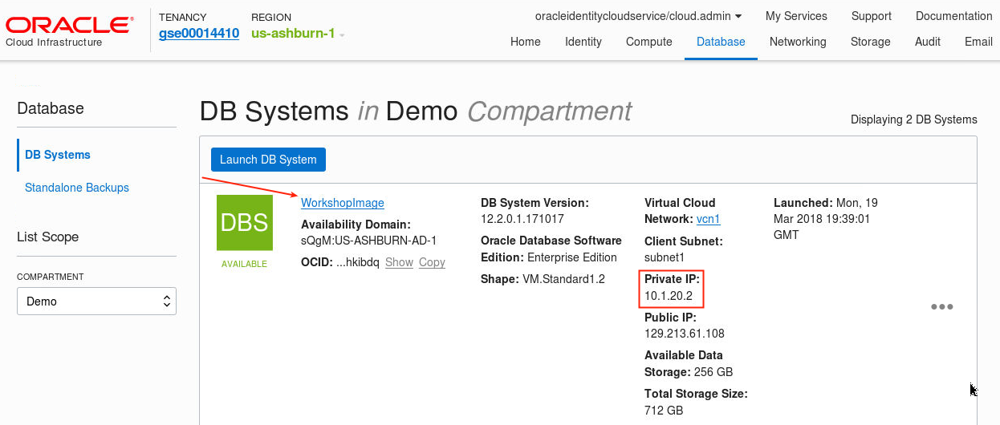

	

-	From the VNC Session desktop, locate and double-click on the **SQL Developer** icon. ***NOTE***: The first time SQL Developer is brought up; it may take some time to instantiate.  Right click on the Local Sys CDB connection

	

	

-	Enter the details and test the connection.  Enter as password of `ALpha2018__`.

	

-	Save the details, and then select cancel to close the window.

	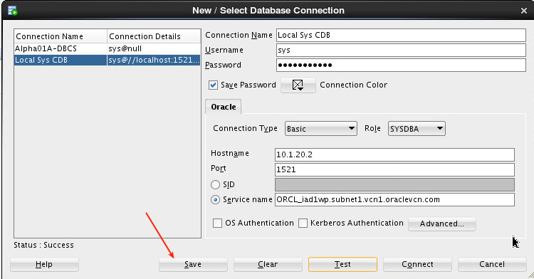

### **STEP 2**:  Open a **DBA Navigator** connection to the on-premise database

-   Select the **View** -> **DBA** menu option from the top dropdown menu.

	

-   On the DBA tab, click the green plus icon to create a new connection.

	**Note**: you may also right-click on Connections and select Add Connection.

	

-   Select the **Local Sys CDB** connection and click **OK**. 

	**Note: Local Sys CDB** is our simulated “on-premises” database in the WorkshopImage Instance. 

	

-   Expand the **Local Sys CDB connect**, and then expand the **Container Database** tree item. Click on the **PDB1** pluggable database to show the details for the pluggable database.

	

## Clone the On-premise PDB1

### **STEP 3**:  Clone the PDB1

-   In the Local Sys CDB connection enter the following.
```
alter pluggable database pdb1 close immediate;

alter pluggable database pdb1 open read only;

create pluggable database new_pdb from pdb1 keystore identified by ALpha2018__
storage unlimited tempfile reuse
file_name_convert=none;

alter pluggable database pdb1 close immediate;

alter pluggable database pdb1 open read write;
```
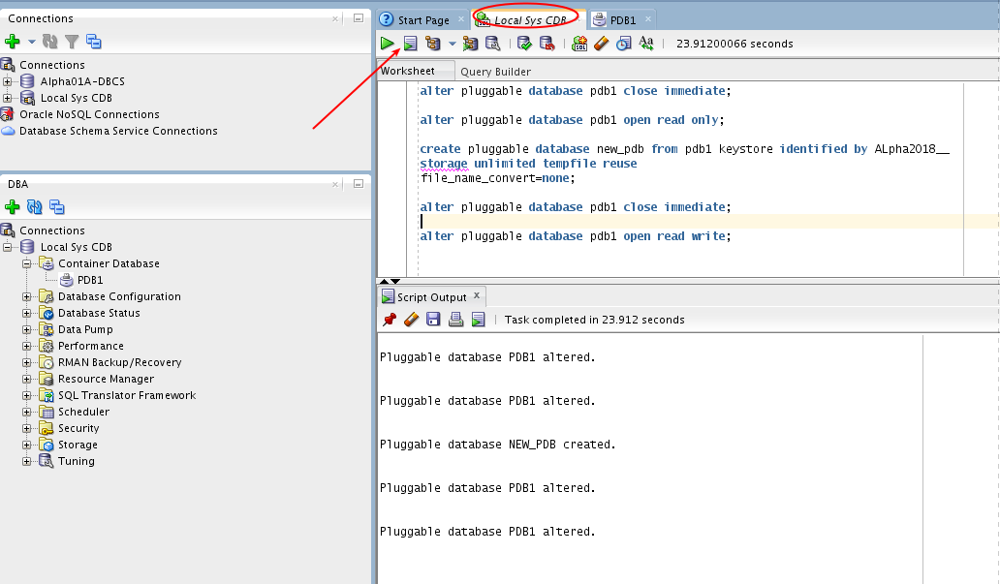

-	Right click on the Container Database connections in the DBA navigator and select refresh.

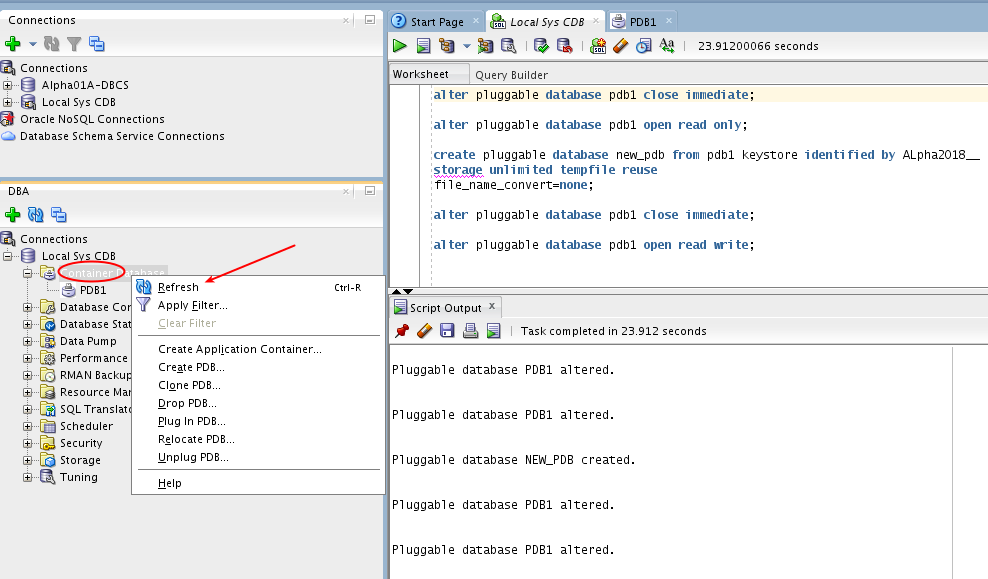

-	Click on the NEW\_PDB database in the DBA navigator to see the status of the database.  Note: The cloned database shows an OPEN_MODE of MOUNTED indicating the database is plugged-in but is not open for access.

	

-	Open the `new_pdb` in read write mode.  Right click on the pdb and select `Modify State`

	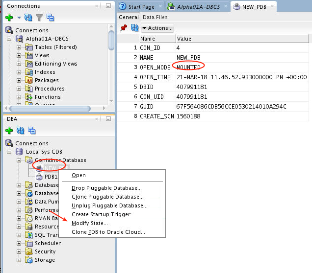

	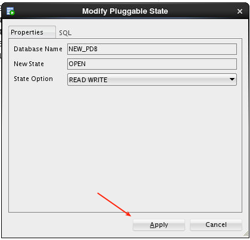

-	Click on the Data Files tab for the NEW_PDB to review the data files created during the cloning operation.  Note that DBCS on OCI is using Automatic Storage Management (ASM).  

	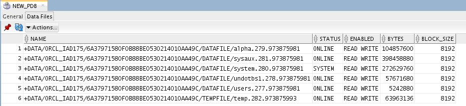

## Clone the NEW_PDB DB to the Cloud

### **STEP 4**:  Update the sqlnet.ora file.

All Oracle DBCS Services are protected by Transparent Data Encryption (TDE) by default.  Wallets with encrypted keys are used to encrypt and decrypt the data.  Any time you move the dbf data files from one instance to another you need to migrate the keys with the data.  Review the sqlnet.ora file.  It specifies the wallet directory location.  This needs to be updated to replace the `$ORACLE_UNQNAME` variable with your database unique name (literal rather than variable).  Open a terminal window and enter the following.
```
. oraenv (enter ORCL when prompted)
cat /u01/app/oracle/product/12.2.0.1/dbhome_1/network/admin/sqlnet.ora
```


-	Update it with the following command.  Be sure to specify the name of the database noted earlier (you should have written this down).  You are replacing $ORACLE_UNQNAME with your own ORCL_iad... name (case sensitive).  Optionally AFTER this re-run the cat command (above) to confirm the update.
```
sed -i 's/$ORACLE_UNQNAME/<your database unique name for WorkshopImage>/g' /u01/app/oracle/product/12.2.0.1/dbhome_1/network/admin/sqlnet.ora
```


### **STEP 5**:  Clone NEW_PDB in WorkshopImage to Alpha01A-DBCS

-	Since we need to use tunnels to communicate with the remote DBCS instance when using ports other than 22 (which is open) we need to create a new tunnel for port 1521 back to WorkshopImage.  We first copy the SSH private key to Alpha01A-DBCS.  We then open a new terminal window and SSH into the remote Alpha01A-DBCS instance - see terminal window heading).  You will then create a tunnel in Alpha01A-DBCS back to WorkshopImage.  This might seem confusing as you are connecting to a remote instance and then creating a tunnel back to originating instance.  This will be used by the database.
```
scp -o StrictHostKeyChecking=no -i /tmp/ws/privateKey /tmp/ws/privateKey opc@<Alpha01A-DBCS IP>:.
ssh -i /tmp/ws/privateKey opc@<Alpha01A-DBCS IP>
ssh -o StrictHostKeyChecking=no -i privateKey -L 1530:<Private IP of WorkshopImage>:1521 opc@<WorkshopImage IP>
```
- Minimize this window but do not close it.

	

-	Next open SQL Developer and then open the Alpha01A-DBCS connection. 

	

-	Create a database link in Alpha01A-DBCS that points back to the WorkshopImage.  Note the database link name must match the source database and hostname.  Enter the following.

```
create database link ORCL.subnet1.vcn1.oraclevcn.com
connect to system identified by ALpha2018__
using '(DESCRIPTION=(ADDRESS=(PROTOCOL=TCP)(HOST=localhost)(PORT=1530))(CONNECT_DATA=(SERVER=DEDICATED)(SERVICE_NAME=<database unique name>.subnet1.vcn1.oraclevcn.com)))';
```


-	Test the link.  Enter the following.  Note that tunnels do tend to drop enventually over time.  If you get an error check that your tunnel is still up and in effect.
```
select sysdate from dual@orcl.subnet1.vcn1.oraclevcn.com;
```


-	Reestablish tunnel if necessary (if you get an error).

	

-	Clone the NEW_PDB.  Enter the following in SQL Developer.  This will take several minutes.
```
create pluggable database new_pdb FROM new_pdb@orcl.subnet1.vcn1.oraclevcn.com keystore identified by ALpha2018__;
```
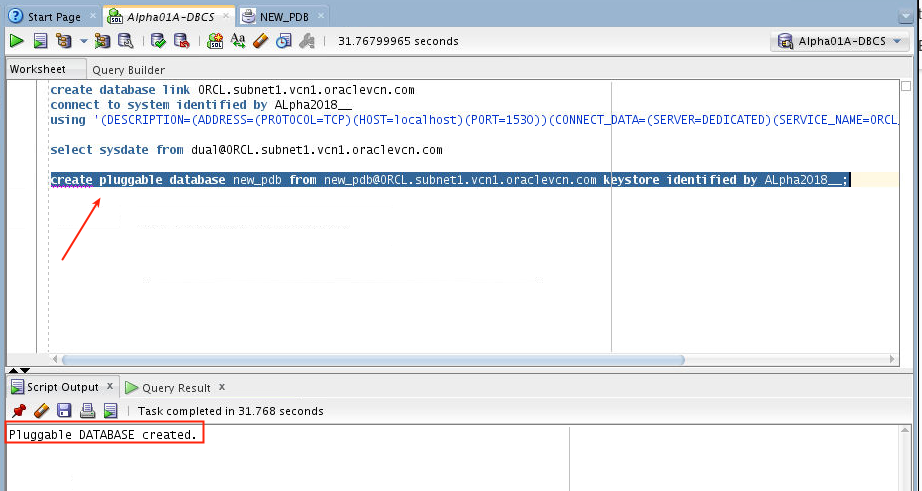

### **STEP 6**:  Create a SQL Developer connection to the Public Cloud database ALPHAPDB schema

-	Back in SQL Developer select the DBA view from the drop down.  We are first going to confirm the NEW_PDB exists now in the Alpha01A-DBCS instance.  

	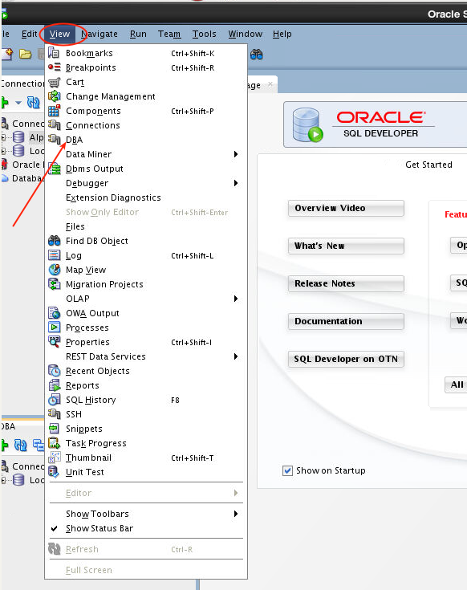

-	Right click on the Connections in the DBA panel and add the Alpha01A-DBCS connection.

	

-	Expand the Container Database branch and confirm NEW_PDB exists.  Click on it - note that it is in mounted state.

	

-	Right click on NEW_PDB and select modify state, and then hit Apply.

	

	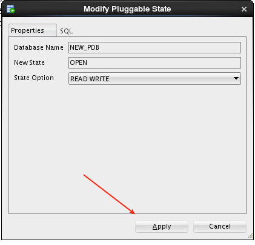

	

-   Now right click the Alpha01A-DBCS connection and select properties.  We will edit this to create a new connection to the NEW_PDB PDB.  window to create a new connection; enter the following connection details and click Save and then test to confirm the information was entered correctly.
	- **Connection Name**:	`Alpha01A-DBCS-NEW_PDB`
	- **Username**:			`alpha`
	- **Password**:			`ALpha2018__`
	- **Check** "Save Password"
	- **Optionally select a color for the connection**
	- **ConnectionType**:		`SSH`
	- **Role:** `default`
	- **Port Forward:**		`Database (Alpha01A-DBCS)`
	- **Service Name**:		`new_pdb.<Your ID Domain>.oraclecloud.internal`
	
	

-   Click **Connect** to save the connection information, expand the connection on the left, and then expand the tables to confirm the migration was successful.

	

# Cloud Migration Using Data Pump: Schema Level

## Export the Alpha Schema

### **STEP 7**:  Run datapump export

-	Open a new terminal window and export the data.
```
. oraenv (enter ORCL when prompted)
expdp alpha/ALpha2018__@pdb1 directory=tmp dumpfile=alphaexp.dmp compression=all
```
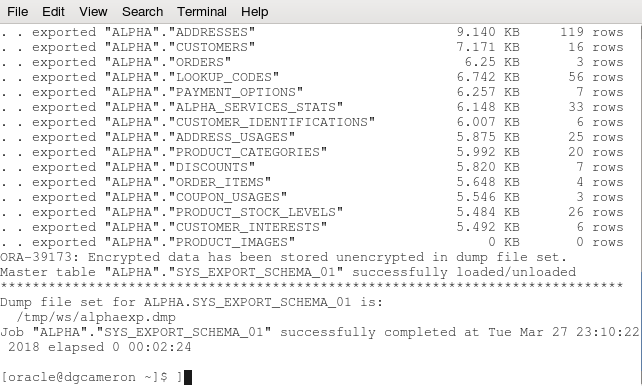

### **STEP 8**:  Copy the export Data Pump file to the server

-   Use the following secure copy (**scp**) command to transfer the Data Pump export to the Alpha01A-DBCS instance.
```
scp -i /tmp/ws/privateKey /tmp/ws/alphaexp.dmp opc@<Alpha01A-DBCS IP>:/tmp/alpha
```
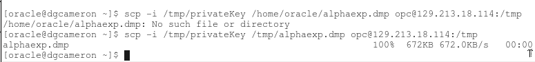

### **STEP 9**:  Log into Alpha01A-DBCS and update the sqlnet.ora file to add the pdb1 connection.

-	This has been done for you already.  Review the connections that were added (pdb1 and new_pdb).
```
ssh -i /tmp/ws/privateKey opc@<Alpha01A-DBCS IP>
chmod a+rw /tmp/alpha/alphaexp.dmp
sudo su - oracle
cat /u01/app/oracle/product/12.2.0.1/dbhome_1/network/admin/tnsnames.ora
```
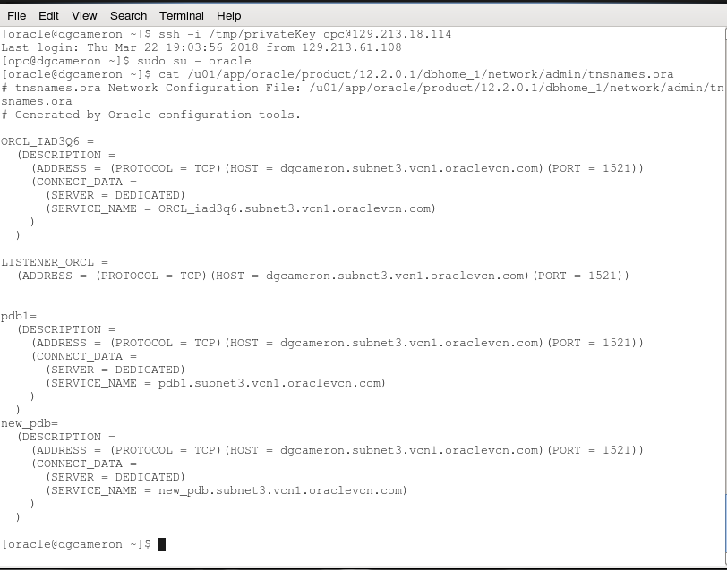

### **STEP 10**:  Create a new schema to hold a copy of the data

-	Using the current open terminal window enter the following commands that will create an Oracle directory, and import the data.
```
. oraenv (enter ORCL when prompted)
sqlplus system/ALpha2018__@pdb1; (log into system in the alphapdb)
create user alpha2 identified by ALpha2018__;  (create schema alpha2 - alpha already has the data from the previous lab)
grant dba to alpha2;
connect alpha2/ALpha2018__@pdb1; (connect to alpha2 so we can create the oracle directory)
create directory tmp as '/tmp/alpha'; (this may already exist)
exit
```
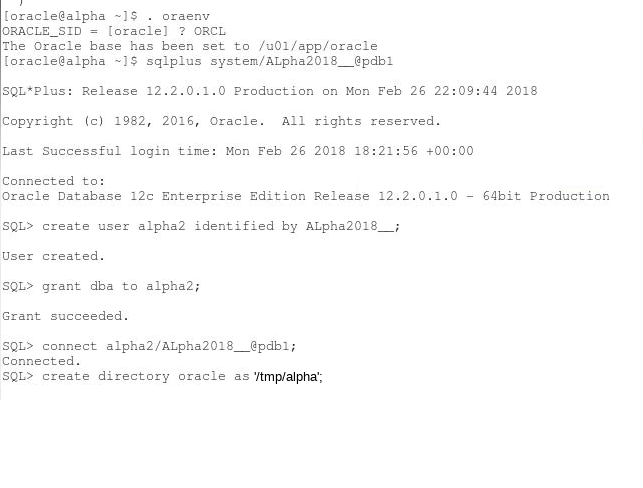

### **STEP 11**:  Import the data

-	Import the data from the alpha schema to the new alpha2 schema.  Run the following command in your terminal window.
```
impdp alpha2/ALpha2018__@pdb1 directory=tmp dumpfile=alphaexp.dmp remap_schema=alpha:alpha2
```
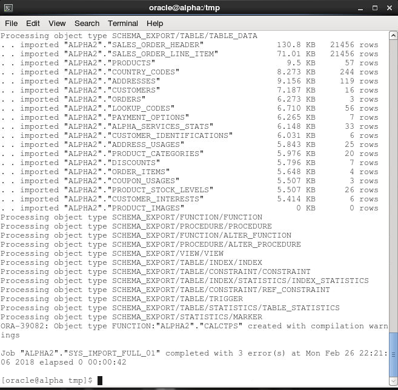

# Cloud Migration Using Data Pump: Tablespace Level

While datapump provides a very fast multi-threaded technique to move data quickly between Oracle Databases, it was not designed for very large volumes of data.  Transportable Tablespaces enable a database file copy technique that does not require an exported copy of the data, but instead allow you to copy the in-place data files to target, which using Datapump to capture the metadata only.

## Replicate Current Data to Archive Tablespace

We will be creating a copy of the alpha schema and tablespace, and replicating that to a alpha_archive schema and tablespace.

-	Open a new terminal window in the WorkshopImage Desktop and execute the following (ie the previous terminal window is connected to the Alpha01A-DBCS).:
```
. oraenv (enter ORCL when prompted)
/tmp/ws/oci_ws_cr_tablespace.sh
```
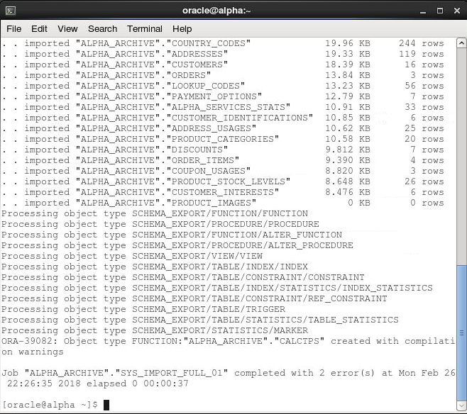

### **STEP 12**:  Open alpha_archive tablespace in read only mode and export the metadata

-	Log into the database, put the alpha_archive tablespace in in read only mode, and export the tablespace metadata.
```
sqlplus system/ALpha2018__@pdb1
alter tablespace alpha_archive read only;
exit
expdp system/ALpha2018__@pdb1 directory=tmp dumpfile=alpha_archive_tbs.dmp transport_tablespaces=alpha_archive exclude=statistics encryption_password=ALpha2018__ logfile=full_tts_export.log
```
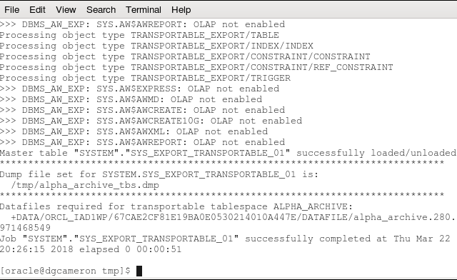


### **STEP 13**:  Copy the metadata to the target Alpha01A-DBCS instance

-	Copy the alpha_\archive_tbs.dmp (metadata) file.  In the terminal window enter the following:
```
scp -i /tmp/ws/privateKey /tmp/ws/alpha_archive_tbs.dmp opc@<Alpha01A-DBCS IP>:/tmp/alpha
```
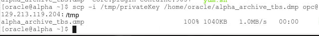

### **STEP 14**:  Copy the datafile to the target Alpha01A-DBCS instance

-	Since DBCS-OCI uses Automatic Storage Management (ASM) we need to locate the datafile in ASM first.  Go to SQL Developer to do that.  Open the DBA view and click on the PDB1 pluggable database in the Local Sys CDB connection.

	

-	Open a new terminal window and start ASM CLI.  Enter the following:
```
. oraenv (enter ORCL when prompted)
asmcmd -a sysdba
```
-	Enter the cp command to copy the data file to the tmp directory.  Select the alpha_archive datafile as shown in the screenshot (your name/version will be different)
```
cp <asm path to alpha_archive data file> /tmp/ws
```


-	Exit out of asmcmd and then SCP (copy) the dbf file to Alpha01A-DBCS.
```
exit
scp -i /tmp/ws/privateKey /tmp/ws/alpha_archive.<your asm file version number> opc@<Alpha01A-DBCS IP>:/tmp/alpha
```


-	SSH into Alpha01A-DBCS and change ownership of the alpha_archive files.
```
ssh -i /tmp/ws/privateKey opc@<Alpha01A-DBCS IP>
sudo su -
chown oracle /tmp/alpha/*
exit
```
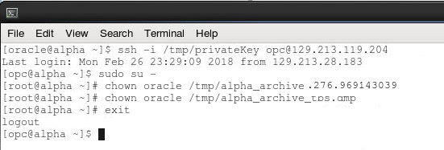

-	Return to SQL Developer, open the DBA view, and select the PDB1 pluggable database in Alpha01A-DBCS instance.

	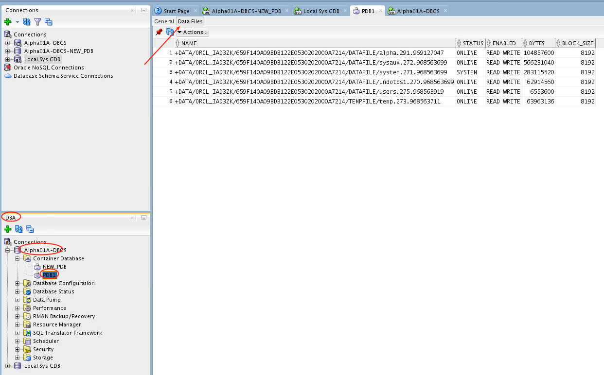

-	Copy the dbf file into the PDB1 using ASMCMD.  Enter the following in asmcmd command shell.  You should be still SSH'd into Alpha01A-DBCS and logged in as oracle (sudo su - oracle) from the previous step.
```
sudo su - oracle
. oraenv (enter ORCL when prompted)
chmod a+r /tmp/alpha/alpha_archive.<asm file version>
asmcmd -a sysdba
cp /tmp/alpha/alpha_archive.<version number> <your asm directory for pdb1>/alpha_archive
ls <your asm directory>/datafile
exit
```


### **STEP 15**:  Import the tablespace into the target DBCS instance

We will be importing the data into the pdb1 instance.  We need to first create the alpha_archive user that owns the data.

-	Using the same terminal window above that is SSH'd into Alpha01A-DBCS, log in, and create alpha_archive user (must already exist in the target).
```
sqlplus system/ALpha2018__@pdb1
create user alpha_archive identified by ALpha2018__;
grant dba to alpha_archive;
exit
```


-	Import the metadata (the data is already there in the dbf file).  Ignore the trigger error messages.
```
impdp system/ALpha2018__@pdb1 directory=tmp dumpfile=alpha_archive_tbs.dmp logfile=full_tts_imp.log encryption_password=ALpha2018__ transport_datafiles='<your asm directory>/alpha_archive'
```


-	Confirm tablespace and contents exist by querying the Oracle dictionary.  Log into sqlplus and run the following query.
```
sqlplus system/ALpha2018__@pdb1
select tablespace_name, count(*) from dba_tables where owner='ALPHA_ARCHIVE' group by tablespace_name;
exit
```


# Cloud Migration Using Database Links (Table Level)

Occasionally you just want to copy one or more tables from one database to another, and the easiest/quickest way to do that is to use a database link.  A database link connects two databases with sqlnet allowing you to reference remote tables in your local database.  This is good for table data, but other object types such as stored procedures, etc. cannot be replicated as easily.

## Create a Database Link
 
 Note this was done in step 4 above as part of the hot PDB migration to copy data FROM the WorkshopImage to Alpha01A-DBCS.  In that step you created a database link IN Alpha01A-DBCS that pointed back to WorkshopImage.  In this step we will create a link in WorkshopImage that points to Alpha01A-DBCS. 

### **STEP 16**:  Create Database Link on the local system (WorkshopImage)

-	Since we need to use tunnels to communicate with the remote DBCS instance when using ports other than 22 (which is open) we need to create a new tunnel for port 1521.  Open a new terminal window (be sure you are not SSH into the remote Alpha01A-DBCS instance - see terminal window heading).  We will tunnel on 1540 (1521 is already used, and 1530 may be used in SQL Developer).
```
ssh -o StrictHostKeyChecking=no -i /tmp/ws/privateKey -L 1540:<Private IP of Alpha01A-DBCS>:1521 opc@<Public IP of Alpha01A-DBCS>
```
- Minimize this window.

	

-	Log into SQL Plus and create the database link.  Be sure to update this command with your Identity Domain.
```
. oraenv
sqlplus alpha/ALpha2018___@pdb1;

create database link PDB1.subnet3.vcn1.oraclevcn.com
connect to alpha identified by ALpha2018__
using '(DESCRIPTION=(ADDRESS=(PROTOCOL=TCP)(HOST=localhost)(PORT=1540))(CONNECT_DATA=(SERVER=DEDICATED)(SERVICE_NAME=<database unique name>.subnet3.vcn1.oraclevcn.com)))';

select sysdate from dual@pdb1.subnet3.vcn1.oraclevcn.com;
```
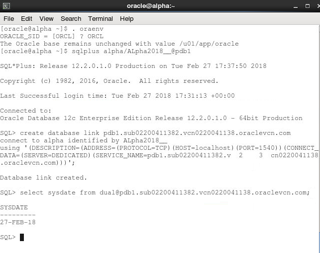

-	Query the REMOTE alpha_archive schema in Alpha01A-DBCS and list tables.  Then copy a table from the remote DBCS to the local instance.  Note that you cannot create a remote table (DDL operation) on the remote server but you can do an insert operation.  
	- `select table_name from user_tables@pdb1.subnet3.vcn1.oraclevcn.com;`

	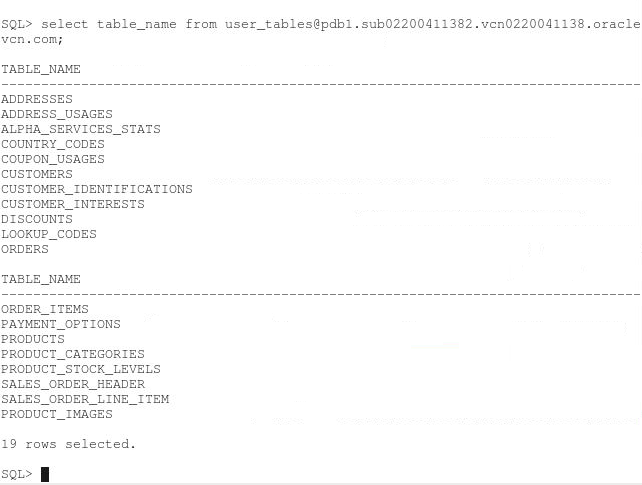

```
create table alpha_services_stats_archive as select * from alpha_services_stats@pdb1.subnet3.vcn1.oraclevcn.com;
```


This lab shows how you can copy entire databases, tablespace datafiles, schemas, and individual tables between on-premise databases and cloud databases.  Depending on the use case one or more of these approaches may be applicable.