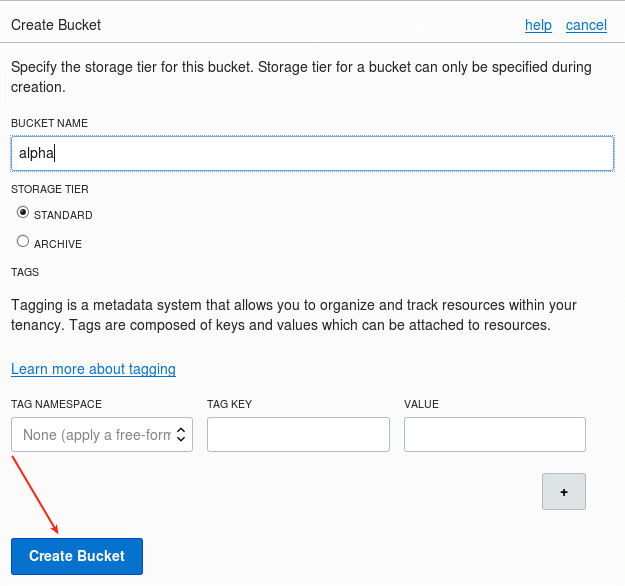

Update: March 1, 2018

## Introduction

In this Lab you will use the Oracle Command Line Interface (CLI) to retrieve information about the configuration and status of various cloud services without the need to use the Cloud Console.  Note you may wish to open a separate text window with your identity domain account and password to copy/paste these into the placeholders in the following commands, and then copy this into the terminal windows.

This lab supports the following use cases:
-	Use of Oracle's API to manage cloud databases.

Please direct comments to: Derrick Cameron (derrick.cameron@oracle.com)

## Objectives

- Install Oracle CLI
- Use OCI commands to request information about DBCS related configuration and services.
- Create services with oci commands.

## Required Artifacts

-   There are no dependencies for this lab.

## Create an Object Store Bucket and Install Oracle CLI.

### **STEP 1**:  Create an Object Store Bucket.  

Note if you completed Lab 300 and did the RMAN Backup your bucket will already have been created.

- To create an object store bucket go to the cloud console and select Database (OCI).

  

  

- Select Storage - Object Storage and select the Demo Compartment (or your working compartment).

  

  

- Select `Create Bucket`.

  

- Call the Bucket `alpha`.  Accept the defaults.

  

We will use the bucket later.

### **STEP 2**:  Collect Keys for use by the Oracle CLI in Step 3

- The following keys will be needed.  Open a notepad and save these for the configuration in step 3:
  - `tenancy` -- select tenancy and then copy OCID

  

  - `region`

  

  - `compartment-id` -- return to Storage - Object Storage and select the alpha bucket

  

### **STEP 3**:  Install Oracle CLI

- We need to use the opc user for the following steps.  Open a terminal window and enter the following.  
  - `ssh -i /tmp/privateKey opc@localhost` -- log into the WorkshopImage as opc
  - `sudo yum install gcc libffi-devel python-devel openssl-devel` -- enter Y to all prompts

  

  

- Now install the CLI.  Enter the following.  This will take a few minutes.
  - `bash -c "$(curl -L https://raw.githubusercontent.com/oracle/oci-cli/master/scripts/install/install.sh)"` -- accept the defaults (Y)

  

  

- Configure CLI.  Enter the following:
  - `oci setup config` -- take the defaults

  

- Respond to prompts with the OCIDs you copied in the previous step.  Accept Y to generate a new RSA key pair and accept location defaults.

  

### **STEP 4**:  Upload the Public Key

- We need to upload the public key.  Go to Identity - Users.  Then click on the `api.user` user, and then click on `Add Public Key`.

  

  

  

- While the Add Public Key is open enter the following in the terminal window.  We will paste the key contents into this open window.
  - `cat .oci/oci_api_key_public.pem`

  

- Highlight the key and right click to copy.  Then paste into the key window.

  

  

- Copy the fingerprint to your notepad.  We'll use this later. 

  

## Example CLI Requests

### **STEP 5**: Retrieve Cloud Environment Objects

-	List regions.  Enter the following in a command window.
  - `oci iam region list` --output table

  

-	List compute images.  Substitute your compartment-id in the <compartment-id> placeholder.
  - `oci compute image list -c <compartment-id> --output table --query "data [*].{ImageName:\"display-name\", OCID:id}"`

  

### **STEP 6**: Retrieve Database Related Information and Create a New VCN

- When installing the CLI tool a config file was generated and you enter some information in the prompts.  This information can be entered in the command line as parameters, but this can become lengthy.  Note that the install created a `.oci` (hidden) directory in the user's home directory.  Review the contents - enter the following. We will be make more CLI requests that will have additional parameters.  These parameters can be added to the config file to save typing in the future.
  - `ls -l .oci`
  - `cat .oci/config`

  

- Besides reading the CLI reference documentation, an additional tip is to use the -h (or --help) parameter.  To see this enter the following:
  - `oci db database -h` -- you can scroll down, and then hit q to exit
  - `oci db database list -h -- enter q to quit

  

  

- To list databases (within database services) we'll need the db-system-id.  Go to the cloud console to get that.  Select the Alpha01A-DBCS system, and then select the OCID:

  

  

- Then go back to the terminal window and enter the following:
  - `oci db database list --compartment-id <copy your compartment-id from above> --db-system-id <paste the OCID here>`

  

- List Virtual Cloud Networks. 
  - `oci network vcn list -c <copy your compartment-id here>` -- note that -c is a shortcut for --compartment-id

  

- Create a new VCN.  First review our current VCN (menu Network - Virtual Cloud Network).

  

- Create a new VNC.  Note you will need to supply an additional parameter - cidr-block.  We can copy that from the previous command.

  

- Go back to the Cloud Console and confirm the VCN was created.

  

- Confirm the file was uploaded.  Navigate to Object Storage and review the alpha bucket (menu Storage - Object Storage).

  