Update January 22, 2018

# Setup

This workshop requires several setups steps that are normally done in advance as part of an automated process prior to running the labs.  In cases where a customer wishes to run through the workshop themselves on their own without the support of Global Services Engineering (GSE) they must first walk through the following steps.  

### **STEP 1**: Log into the Cloud Console

The following creates a new DBCS Enterprise instance with backup to cloud.  Use your own SSH key or generate a new one.  

-	Log into your identitity domain/trial account.

	

-	Customize dashboard if you do not see any current services.

	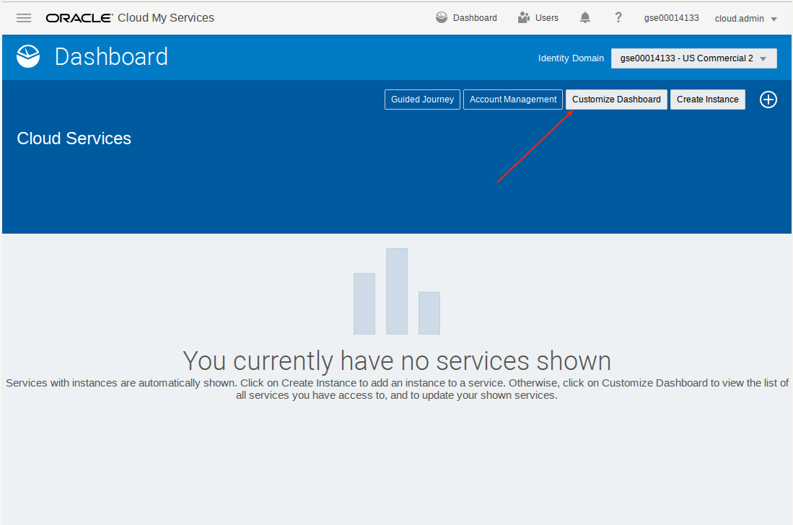

-	Select show Database.  Be sure to select **Database (OCI)** and not Database

	

-	Select Database (OCI), and then Open Service Console

	

	

### **STEP 2**: Create Virtual Cloud Network

-	Select Networking, then Virtual Cloud Netowork.

	

-	Create Virtual Cloud Network.  Be sure to select the correct Compartment (ie. not root or Managed Compartment for PaaS)

	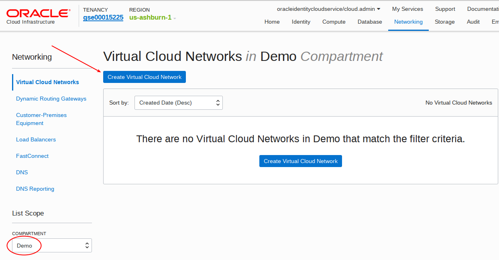

-	Enter the following and then select `Create Virtual Cloud Network`:
	- **Compartment:** `Demo`
	- **Name:** `vcn1`
	- **CIDR BLOCK:** `10.0.0.0/16`

	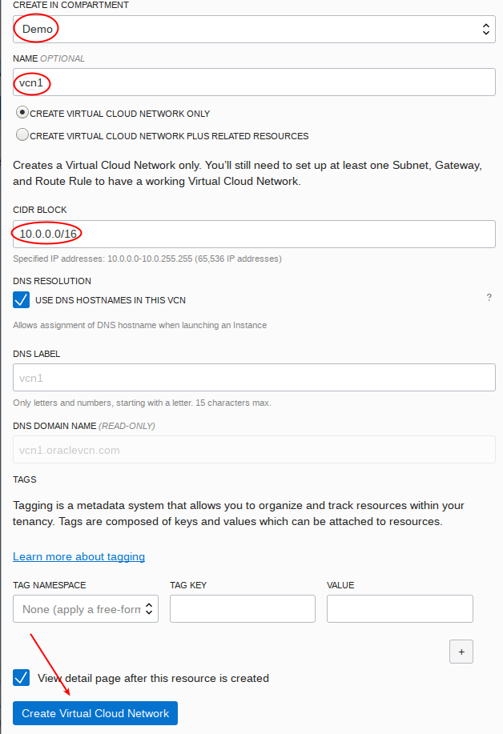

-	Next Create subnets.  We will create a subnet for each of the availability zones 1-3.

	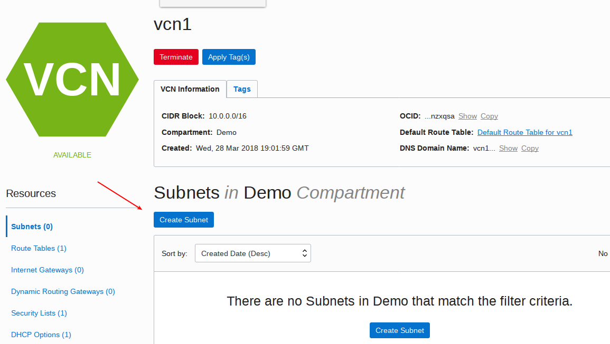

-	Enter the following:
	- **Name:** `subnet1`
	- **Availability Zone:** `<select the first one>`
	- **CIDR BLOCK:** `10.0.0.0/24`
	- **ROUTE TABLE:** `Default Route Table for vcn1`
	- accept defaults for the remaining fields, scroll to the bottom, and select 

	

	

-	Create subnet2 and subnet3 along similar lines.  The CIDR BLOCK and availability zones are:
	- **subnet2:** `CIDR BLOCK 10.0.1.0/24, then select the second availability zone`
	- **subnet3:** `CIDR BLOCK 10.0.2.0/24, then select the third availability zone`

-	The result should look like this.

	

### **STEP 3**: Generate SSH Key Pair on Windows Putty (see lower down to generate on Linux O/S).

-	When you create a DBCS instance (next step) you will be prompted for a public key.  This needs to be generated in advance.  Open Puttygen (available from the internet) and select generate a new key pair.

	

-	Then save the public key.

	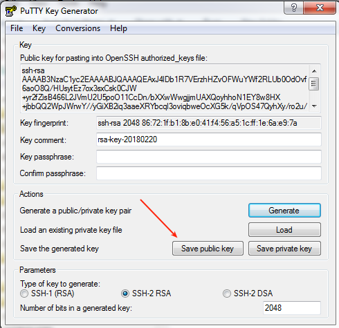

-	Name it publicKey for future reference.

	

-	Then save private key.

	

-	Save it without a passphrase.

	

-	Name it `privateKey` for future reference.

	

-	Next export OpenSSH key for use on the Linux Image later in the labs.  In puttygen go to Conversions.

	

	

-	Name the key `privateKey`.  Note this version will NOT have the .ppk suffix that the private key you saved above.

	

-	IF you are running a Linux OS use the following commands to generate a key pair.  This generates sshkey and sshkey.pub. Note you will need to rename these to privateKey and PublicKey to avoid confusion later in the labs.
	- `ssh-keygen` (name it sshkey, hit enter to accept without a password)
	- `chmod 600 sshkey` (change permissions of the private key)

### **STEP 4**: Create **WorkshopImage** Image (DBCS Instance)

-	Select DB System from top menu.

	

-	Then Launch DB System

	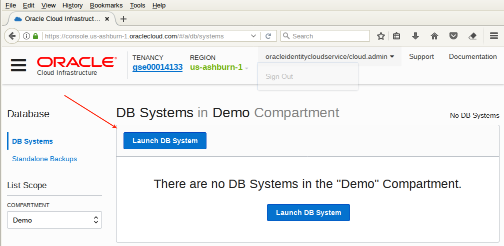

-	Enter details.  Your resources may vary by Availability Domain.  In somecases you may not have available capacity in a Domain, and if this is the case select another Domain.

	

-	Choose ssh key file.

	

-	Select `publicKey`.

	

-	Enter Database information as shown in screen shot.  Enter a password of `ALpha2018__` (note there are 2 underscores at the end).

	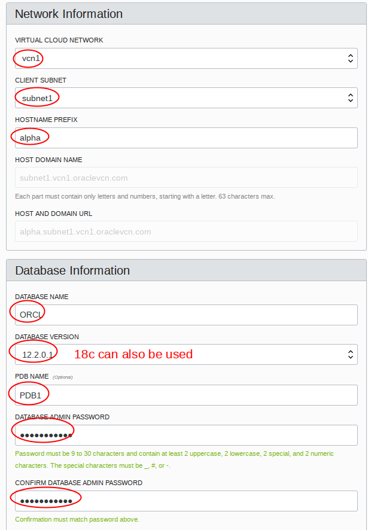

-	Then Launch DB System.

	

-	The system will begin provisioning.  This can take an hour or more.

	

### **STEP 5**: Create **Alpha01A-DBCS** Image (DBCS Instance)

We will create a second DBCS instance to support lab200 activities that involve migrating data between instances.  This second instance will be nearly identical to the first with the following exceptions.  Refer to the steps above for WorkshopImage for the steps, taking note to change the following:

- **Display Name:** `Alpha01A-DBCS`
- **Availability Zone:** `Select the third zone, or if using a customer account, one that has the capacity for an instance`
- **Client Subnet:** `subnet3`

	

	

	

### **STEP 5**: Download the Oracle Backup Module, the Adobe Yum Repository, and the public yum ol6 repository

-	Go to the following site to download opc_installer.zip and save to your local download location:  `http://www.oracle.com/technetwork/database/availability/oracle-cloud-backup-2162729.html`

	

	

-	Go to the following site and download the adobe repository: `https://get.adobe.com/flashplayer/`.  Do not select the default - select download for a different operating system (Linux 64 bit).

	

-	Select the version YUM.

	

	

-	Go to `https://public-yum.oracle.com/public-yum-ol6.repo` and save the page results to your download directory.  

	

-	Then save to your download directory.  Name the file `public-yum-ol6.repo`.

	

### **STEP 6**: Copy files to the WorkshopImage.  See lower down if you are using a Linux OS.

-	Once the WorkshopImage is available log into the Cloud Console to obtain the Public IP address.

	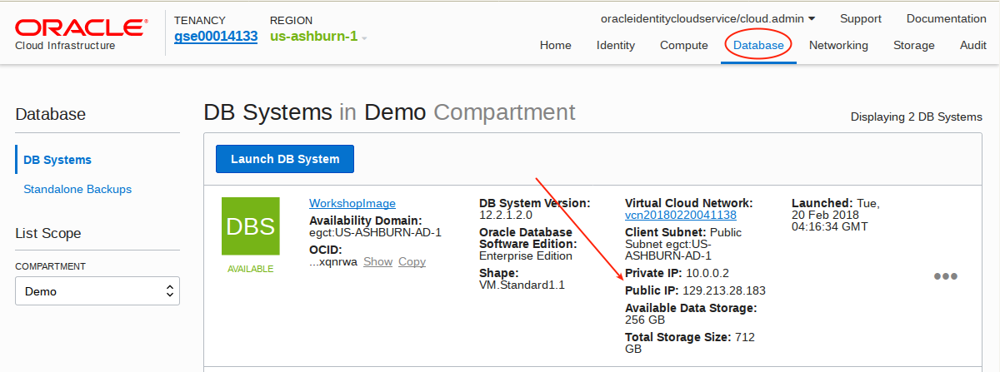

-	Open WinSCP (internet download) and log in to the IP address noted above from the Cloud Console with your private ppk key.

	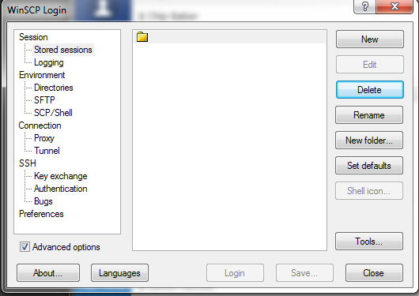

-	Ignore the warning

	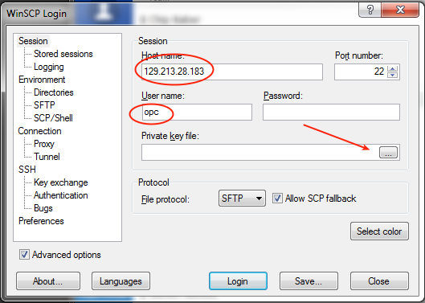

-	Select your private key.

	

	

-	Select yes to cache the key

	

-	Drag the following files from your download location to the oracle folder.

	

	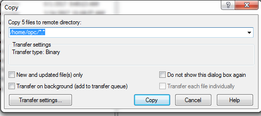

	

-	IF you are using a Linux desktop use the following command (running from the directory where you staged the files).  Otherwise if you are on Windows disregard this step.
```
scp -i privateKey * opc@<WorkshopImage Pubic IP>:.
```

### **STEP 7**: Log into your WorkshopImage and run install scripts

-	Open Putty and log into the DBCS instance.

	

-	Select your SSH private privatekey.ppk key.

	

-	Log in as opc

	

	

-	Copy the files to the /tmp/ws directory.  Enter the following:
```
chmod a+rw *
mv publicKey publicKey.pub
mkdir /tmp/ws
cp * /tmp/ws
```

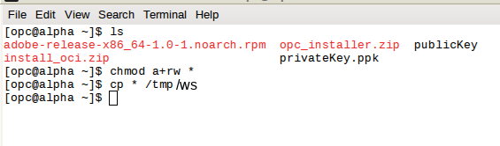

-	Install the yum repository and then adobe and git packages.  Enter the following:
```
sudo su -
cp /tmp/ws/public-yum-ol6.repo /etc/yum.repos.d
rpm -ivh /tmp/ws/adobe-release-x86_64-1.0-1.noarch.rpm
yum -y install svn
exit
```


-	Log in as Oracle and copy the install files from the DBCS Workshop git.
```
. oraenv (enter ORCL when prompted)
sudo su - oracle
svn export https://github.com/pcdavies/DatabaseCloudServiceForDBAsOCI/trunk/workshops/dbcs-dba/install/install_oci.zip
unzip install_oci.zip
exit
```
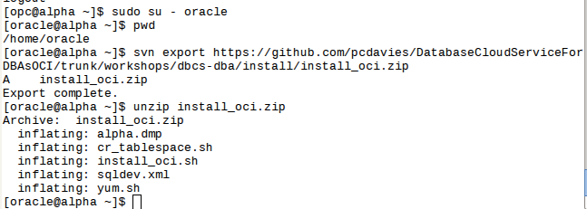

-	Log back in as root and install the desktop packages.  Enter the following.
```
sudo su -
/home/oracle/yum.sh
```


-	While we are logged in as root we also need to open the VNC server port that we'll be starting in the next step.  Enter the following.
```
sed -i 's/IPTABLES_SAVE_ON_RESTART="no"/IPTABLES_SAVE_ON_RESTART="yes"/g' /etc/sysconfig/iptables-config
iptables -I INPUT -p tcp -m tcp --dport 5901 -j ACCEPT
service iptables restart
```


-	Start VNC Server.  You can optionally adjust the geometry to match your screen (eg: `vncserver -geometry 1280x720`).  You will be prompted to enter a password.  Do not use the password that we have been specifying in other places in this lab document.  **VNC is open to the internet.  Select your own secure password.  We suggest you use your cloud password.**.  Be sure you are sudo su to oracle user.
```
exit (this is to exit out of the root user)
sudo su - oracle
vncserver
```


### **STEP 8**: Open Port 5901 (VNC) and log into the desktop

-	Log back into the Cloud Console and select Database Service.

	

	

-	Select Networking - Virtual Cloud Networks.

	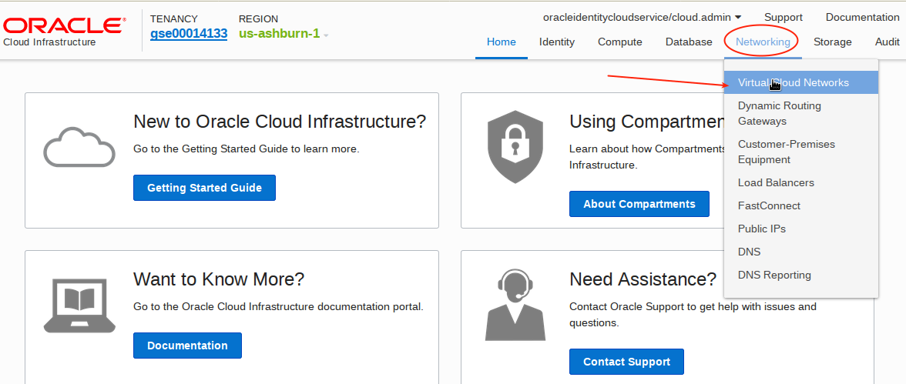

-	Select the Virtual Cloud Network you created earlier.

	

-	Select Security Lists.

	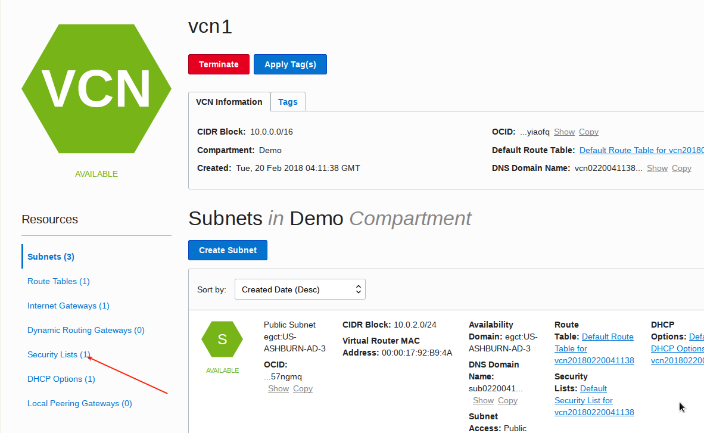

-	Select Default Security List.

	

-	Select Edit All Rules.

	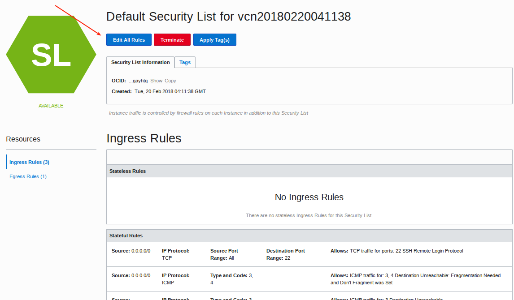

-	Add Ingress Rule opening port 5901.

	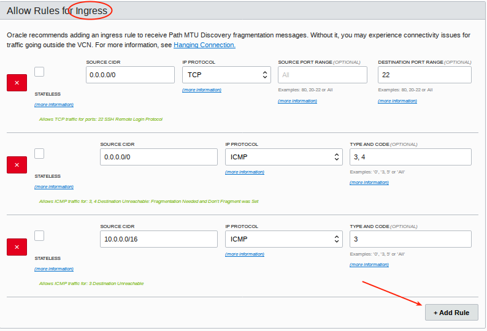

-	Enter the following details. 

	

-	Scroll down and save the rules.  Note the rule will take about a minute to become active.

	

-	Start your VNC **Viewer Client** and log in with the password you entered above.  Use your own WorkshopImage IP address (not the one in the screenshot below).

	

-	This is the WorkshopImage desktop.  The background may be different across the screen shots.  We need to disable the screen saver to prevent a screen unlock prompt.  Go to the system menu on the desktop and de-activate screen saver.  If you delay in this step and the screen locks up you will need to kill the vncserver (`vncserver -kill :1`) and restart it (`vncserver`) in your terminal window.

	

	

### **STEP 9**: Set up shortcut to SQLDeveloper and import connections

-	Right click on the desktop and create a new launcher on the desktop.  Enter the Name and Command:
	- **Name:** `SqlDeveloper`
	- **Command:** `/u01/app/oracle/product/12.2.0.1/dbhome_1/sqldeveloper/sqldeveloper/bin/sqldeveloper`

	

	

-	Select the sqldeveloper icon from the following directory: `/u01/app/oracle/product/12.2.0.1/dbhome_1/sqldeveloper/`

	

	

-	Double click on the desktop icon to start sqldeveloper. Select no to import connections.

	

-	Right click on connections and select import connections.

	

-	Browse for connections file.

	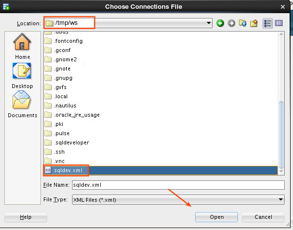

	

	

	

### **STEP 10**: Import data

-	Update the tnsnames.ora file to add pdb1 and new_pdb (used later).  Open a new terminal window and enter the following:
```
gedit /u01/app/oracle/product/12.2.0.1/dbhome_1/network/admin/tnsnames.ora
```

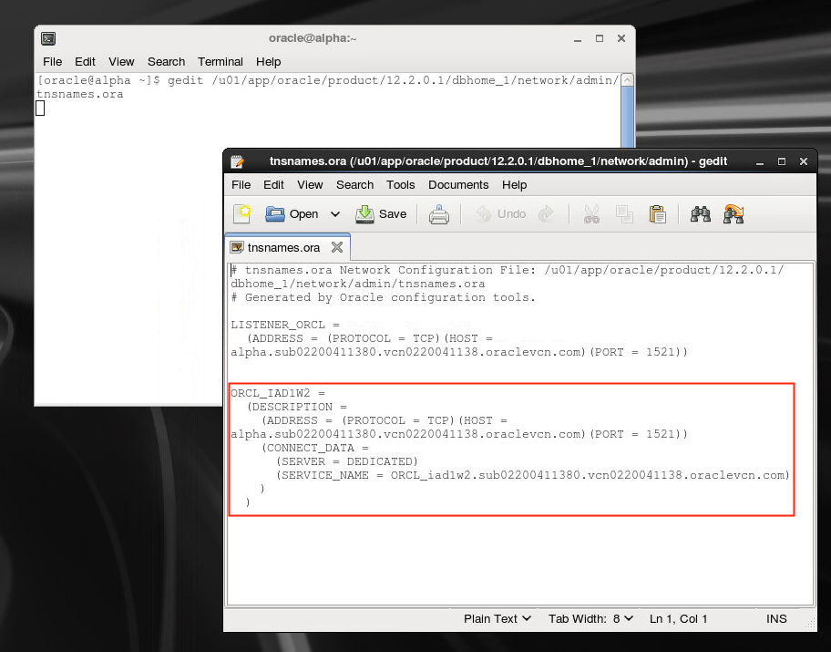

-	Copy the CDB connection entry into two more entries that we'll modify for pdb1 and new_pdb.  Update as follows.  Then save.

	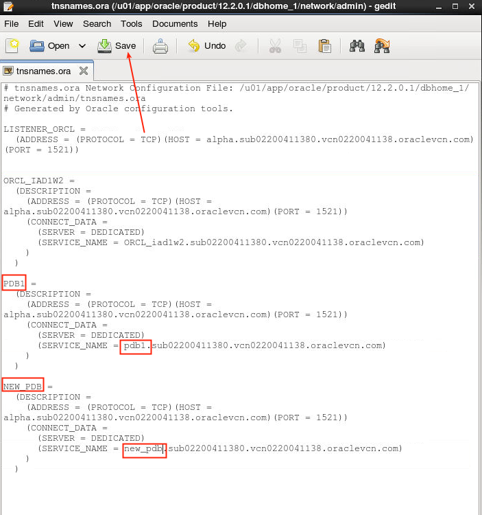

-	Open a terminal window and enter the following:
```
. oraenv (enter ORCL when prompted)
./install_oci.sh
```

