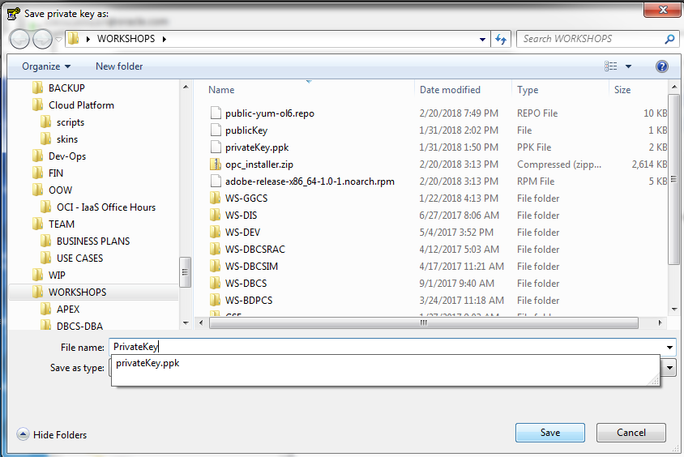
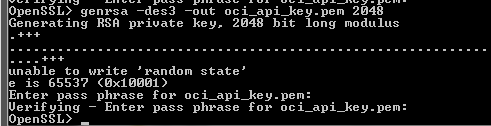
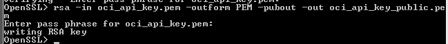

Update April 2, 2018

# Setup

This workshop requires several setups steps that are normally done in advance as part of an automated process prior to running the labs.  In cases where a customer wishes to run through the workshop themselves on their own without the support of Global Services Engineering (GSE) they must first walk through the following steps.  Note there are two setup options: The first is manual, and the second (this one) uses Terraform with the Oracle Terraform OCI Provider.  This is the recommended set as it has fewer steps and configures the cloud automatically.  We have left the manual one in place so you can see what the Terraform process will do for you.  

### **STEP 1**: Download the Terraform Configuration Files and Install Terraform and the Oracle Terraform OCI-Provider.

-	Download and install git.
```
https://git-scm.com/download/win
```
-	Clone the Terraform Repository.

<got to put stuff here>

-	Download and install Terraform.  You have options for where you want to install it.  For the purposes of documenting the instructions we will use `d:\tf` directory.
```
https://www.terraform.io/downloads.html
```
 
 -	Download and install the Oracle Terraform Provider for OCI.
```
https://github.com/oracle/terraform-provider-oci/releases
```

-	Copy the Terraform configuration files from the git above into your Terraform working directory.  The directory should look like this, with the terraform and oci provider and configuration files all on one directory, and keys and scripts sub-directories from the git.

	

### **STEP 2**: Generate SSH Key Pair on Windows Putty

-	Open Puttygen (available from the internet) and select generate a new key pair.

	

-	Then save the public key to your keys directory.

	

-	Name it publicKey for future reference.

	

-	Then save private key to your keys directory

	

-	Save it without a passphrase.

	

-	Name it `privateKey.ppk` for future reference.

	

-	Next export OpenSSH key for use on the Linux Image later in the labs.  In puttygen go to Conversions.

	

	

-	Name the key `privateKey`.  Note this version will NOT have the .ppk suffix that the private key you saved above.

	

-	Copy the three keys (privateKey, privateKey.ppk, publicKey) into your Terraform /keys directory (if they were saved elsewhere.)

### **STEP 3**: Generate Open SSL Key Pair on Windows

-	Download a Open SSL key generation program from the internet.  There are various sites.  The following can be used.
```
https://indy.fulgan.com/SSL/
```

-	Assuming you chose to use this key generation program (you can use your own), generate a private key.  Double click on the OpenSSL.exe file and then enter the following.  You will have to enter a pass phrase (make one up, at least four digits long).
```
genrsa -des3 -out oci_api_key.pem 2048
```




-	Generate the public key.  Enter the following
```
rsa -in oci_api_key.pem -outform PEM -pubout -out oci_api_key_public.pem
```


-	Copy the pem keys from the OpenSSL directory to your /keys directory.  You should have five keys in the keys directory now: public and private OpenSSL pem keys, a public and private SSH key, and a private ppk Windows compatible key.


### **STEP 4**: Download the Oracle Backup Module, the Adobe Yum Repository, and the public yum ol6 repository to your Terraform directory (we are using D:\tf).

-	Go to the following site to download opc_installer.zip and save to your local download location:  `http://www.oracle.com/technetwork/database/availability/oracle-cloud-backup-2162729.html`

	

	

-	Go to the following site and download the adobe repository: `https://get.adobe.com/flashplayer/`.  Do not select the default - select download for a different operating system (Linux 64 bit).

	

-	Select the version YUM.

	

	

-	Go to `https://public-yum.oracle.com/public-yum-ol6.repo` and save the page results to your download directory.  

	

-	Then save to your download directory.  Name the file `public-yum-ol6.repo`.

	

### **STEP 5**: Log into the Cloud Console and Retrieve Account Information

- We need to update the env-vars.bat file in the Terraform directory.  Open this file to review what needs to be updated.

	

	

-	Update the path to your Terraform keys directory.  In this case we have created a tf directory in D.  You may have put your files in another directory.  Update the paths.

	

-	Update the following keys by retrieving them from your cloud account:
	- `tenancy_ocid`
	- ` user_ocid`
	- `fingerprint`
	- `region`
	- `compartment_ocid`

-	Log into your Cloud account:

	

-	Select Customize Dashboard to view Database (OCI) Services.

	

	

-	Select Database (OCI) and then Open the Database Service Console.

	

	

-	Select Tenancy and copy the tenancy_ocid.  Update the env-vars.bat file with this value (paste carefully between the double quotes).

	

	

-	Next go to Identity - Users.  Copy the user_ocid and paste into the env-vars.bat file.

	

	

-	While in this screen Add your Public pem Key.  You will need to navigate to your Terraform /keys directory and open and select the contents to copy.  Paste into the window here.

	

	

-	Copy the fingerprint from the public key and paste into the fingerprint field in the env-vars.bat file.

	

-	Next go to Storage - Object Storage.  

	

-	Create a new bucket in the `Demo` compartment (see lower left for Compartment selection).  Call it `alpha`.  Accept the defaults.

	

	

-	Select the `alpha` bucket, and then copy the compartment_ocid and paste it into the env-vars.bat file.

	

	

-	Copy the Region value into the region varable in env-vars.bat.

	

### **STEP 6**: Run Terraform.

-	Open a command window in the Terraform directory and run env-vars.

-	Then run `terraform init`.  You should see the following.

	

-	Then run `terraform plan`

	

-	Then run 'terraform apply`.  You will be prompted to enter yes after a few seconds.

	

You should now be able to VNC into your WorkshopInstance.
