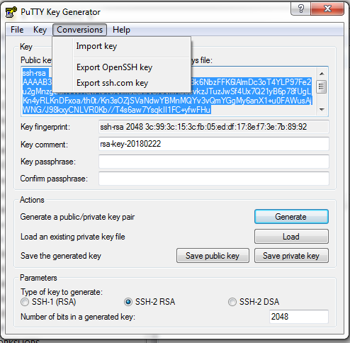

Update January 22, 2018

# Setup

This workshop requires several setups steps that are normally done in advance as part of an automated process prior to running the labs.  In cases where a customer wishes to run through the workshop themselves on their own without the support of Global Services Engineering (GSE) they must first walk through the following steps.  

### **STEP 1**: Install Terraform and the Oracle Terraform OCI-Provider.

-	Download and install Terraform.  You have options for where you want to install it.  For the purposes of documenting the instructions we will use d:\tf directory.
```
https://www.terraform.io/downloads.html
```
 
 -	Download and install the Oracle 
```
https://github.com/oracle/terraform-provider-oci/releases
```

-	Copy the Terraform configuration files into your working directory.  The directory should look like this, with the terraform and oci provider and configuration files all on one directory.

	

### **STEP 2**: Generate SSH Key Pair on Windows Putty

-	Create a keys sub directory in your terraform directory.

	

-	Open Puttygen (available from the internet) and select generate a new key pair.

	

-	Then save the public key to your keys directory.

	

-	Name it publicKey for future reference.

	

-	Then save private key to your keys directory

	

-	Save it without a passphrase.

	

-	Name it `privateKey.ppk` for future reference.

	

-	Next export OpenSSH key for use on the Linux Image later in the labs.  In puttygen go to Conversions.

	

	

-	Name the key `privateKey`.  Note this version will NOT have the .ppk suffix that the private key you saved above.

	

### **STEP 3**: Generate Open SSL Key Pair on Windows

-	Download a Open SSL key generation program from the internet.  There are various sites.  The following can be used.
```
https://indy.fulgan.com/SSL/
```

-	Assuming you chose to use this key generation program (you can use your own), generate a private key.  Double click on the OpenSSL.exe file and then enter the following.  You will have to enter a pass phrase (make one up, at least four digits long).
```
genrsa -des3 -out oci_api_key.pem 2048
```


-	Generate the public key.  Enter the following
```
rsa -in oci_api_key.pem -outform PEM -pubout -out oci_api_key_public.pem
```


-	Copy the pem keys from the OpenSSL directory to your /keys directory.  You should have five keys in the keys directory now: public and private OpenSSL pem keys, a public and private SSH key, and a private ppk Windows compatible key.


### **STEP 4**: Download the Oracle Backup Module, the Adobe Yum Repository, and the public yum ol6 repository to your Terraform directory (we are using D:\tf).

-	Go to the following site to download opc_installer.zip and save to your local download location:  `http://www.oracle.com/technetwork/database/availability/oracle-cloud-backup-2162729.html`

	

	

-	Go to the following site and download the adobe repository: `https://get.adobe.com/flashplayer/`.  Do not select the default - select download for a different operating system (Linux 64 bit).

	

-	Select the version YUM.

	

	

-	Go to `https://public-yum.oracle.com/public-yum-ol6.repo` and save the page results to your download directory.  

	

-	Then save to your download directory.  Name the file `public-yum-ol6.repo`.

	

### **STEP 6**: Copy files to the WorkshopImage.  See lower down if you are using a Linux OS.

-	Once the WorkshopImage is available log into the Cloud Console to obtain the Public IP address.

	

-	Open WinSCP (internet download) and log in to the IP address noted above from the Cloud Console with your private ppk key.

	

-	Ignore the warning

	

-	Select your private key.

	

	

-	Select yes to cache the key

	

-	Create directory /tmp/ws.  Go to Commands and select Open Terminal.  Ignore comment about Linux commands.

	

-	Enter the following and select Execute and then Close.
```
mkdir /tmp/ws
```


-	Change to the /tmp/ws directory and drag the following files from your download location to the /tmp/ws folder.

	

### **STEP 7**: Log into your WorkshopImage and run install scripts

-	Open Putty and log into the DBCS instance.

	

-	Select your SSH private privatekey.ppk key.

	

-	Log in as opc

	

	

-	Change file permissions.  Enter the following:
```
chmod a+rw /tmp/ws/*
```

-	Install the yum repository and then adobe and git packages.  Enter the following:
```
sudo su -
cp /tmp/ws/public-yum-ol6.repo /etc/yum.repos.d
rpm -ivh /tmp/ws/adobe-release-x86_64-1.0-1.noarch.rpm
yum -y install svn
exit
```


-	Log in as Oracle and copy the install files from the DBCS Workshop git.
```
. oraenv (enter ORCL when prompted)
sudo su - oracle
svn export https://github.com/pcdavies/DatabaseCloudServiceForDBAsOCI/trunk/workshops/dbcs-dba/install/install_oci.zip
unzip install_oci.zip
exit
```


-	Log back in as root and install the desktop packages.  Enter the following.
```
sudo su -
/tmp/ws/oci_ws_yum.sh
```


-	While we are logged in as root we also need to open the VNC server port that we'll be starting in the next step.  Enter the following.
```
sed -i 's/IPTABLES_SAVE_ON_RESTART="no"/IPTABLES_SAVE_ON_RESTART="yes"/g' /etc/sysconfig/iptables-config
iptables -I INPUT -p tcp -m tcp --dport 5901 -j ACCEPT
service iptables restart
```


-	Start VNC Server.  You can optionally adjust the geometry to match your screen (eg: `vncserver -geometry 1280x720`).  You will be prompted to enter a password.  Do not use the password that we have been specifying in other places in this lab document.  **VNC is open to the internet.  Select your own secure password.  We suggest you use your cloud password.**.  Be sure you are sudo su to oracle user.
```
exit (this is to exit out of the root user)
sudo su - oracle
vncserver
```


### **STEP 8**: Open Port 5901 (VNC) and log into the desktop

-	Log back into the Cloud Console and select Database Service.

	

	

-	Select Networking - Virtual Cloud Networks.

	

-	Select the Virtual Cloud Network you created earlier.

	

-	Select Security Lists.

	

-	Select Default Security List.

	

-	Select Edit All Rules.

	

-	Add Ingress Rule opening port 5901.

	

-	Enter the following details. 

	

-	Scroll down and save the rules.  Note the rule will take about a minute to become active.

	

-	Start your VNC **Viewer Client** and log in with the password you entered above.  Use your own WorkshopImage IP address (not the one in the screenshot below).

	

-	This is the WorkshopImage desktop.  The background may be different across the screen shots.  We need to disable the screen saver to prevent a screen unlock prompt.  Go to the system menu on the desktop and de-activate screen saver.  If you delay in this step and the screen locks up you will need to kill the vncserver (`vncserver -kill :1`) and restart it (`vncserver`) in your terminal window.

	

	

### **STEP 9**: Set up shortcut to SQLDeveloper and import connections

-	Right click on the desktop and create a new launcher on the desktop.  Enter the Name and Command:
	- **Name:** `SqlDeveloper`
	- **Command:** `/u01/app/oracle/product/12.2.0.1/dbhome_1/sqldeveloper/sqldeveloper/bin/sqldeveloper`

	

	

-	Select the sqldeveloper icon from the following directory: `/u01/app/oracle/product/12.2.0.1/dbhome_1/sqldeveloper/`

	

	

-	Double click on the desktop icon to start sqldeveloper. Select no to import connections.

	

-	Right click on connections and select import connections.

	

-	Browse for connections file.

	

	

	

	

### **STEP 10**: Import data

-	Update the tnsnames.ora file to add pdb1 and new_pdb (used later).  Open a new terminal window and enter the following:
```
gedit /u01/app/oracle/product/12.2.0.1/dbhome_1/network/admin/tnsnames.ora
```


-	Copy the CDB connection entry into two more entries that we'll modify for pdb1 and new_pdb.  Update as follows.  Then save.

	

-	Open a terminal window and enter the following:
```
. oraenv (enter ORCL when prompted)
./install_oci.sh
```

