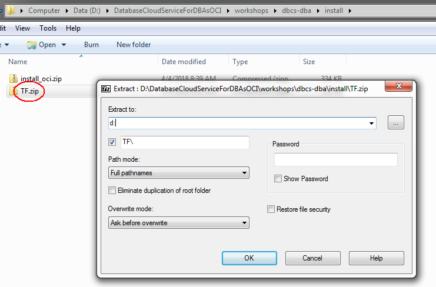
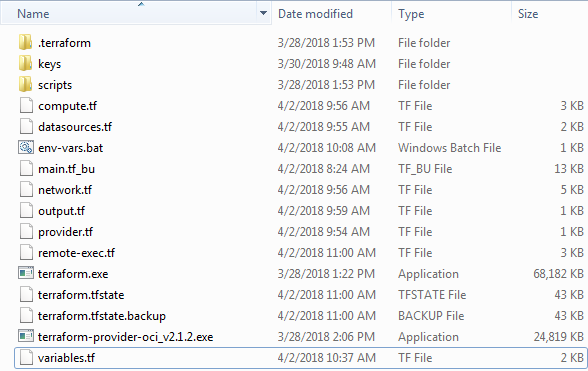
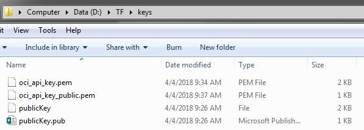
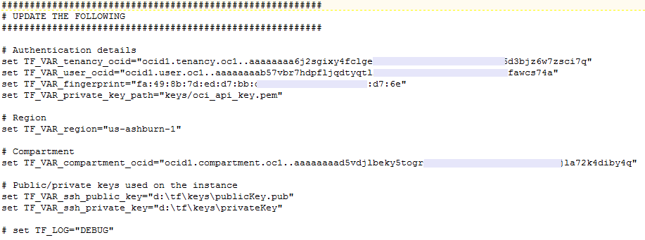
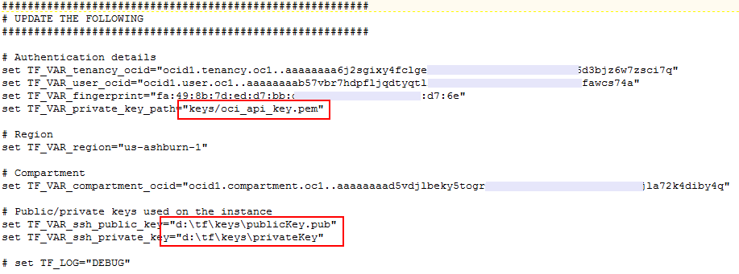
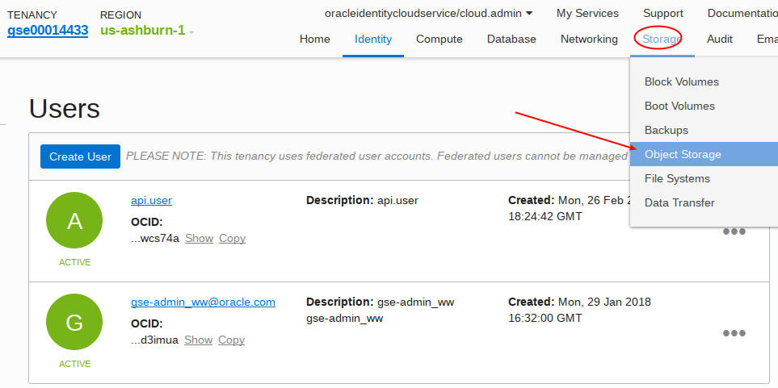
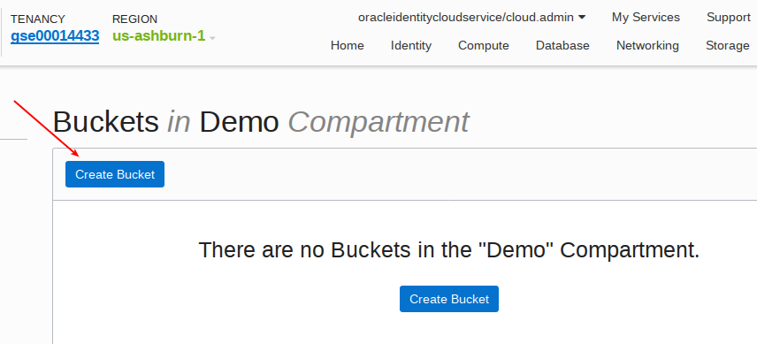
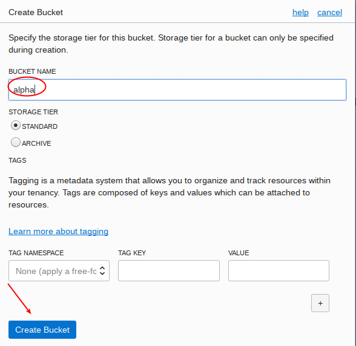
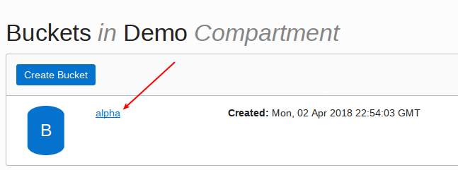
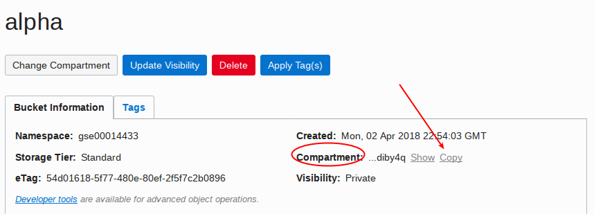

Update April 2, 2018

# Setup

This workshop requires several setups steps that are normally done in advance as part of an automated process prior to running the labs.  In cases where a customer wishes to run through the workshop themselves on their own without the support of Global Services Engineering (GSE) they must first walk through the following steps.  Note there are two setup options: The first is manual, and the second (this one) uses Terraform with the Oracle Terraform OCI Provider.  This is the recommended set as it has fewer steps and configures the cloud automatically.  We have left the manual one in place so you can see what the Terraform process will do for you.  

### **STEP 1**: Install Git, Download the Terraform Configuration Files, and Install Terraform and the Oracle Terraform OCI-Provider

-	Download and install git.
```
https://git-scm.com/download/win
```
-	Clone the Terraform Repository.  We are cloning to d: (you can clone elsewhere).  Open a command window and enter the following.
```
git clone https://github.com/pcdavies/DatabaseCloudServiceForDBAsOCI.git
```


-	Extract the Terraform configuration files from the git above into your Terraform working directory.  In our case we are extracting from `d:\DatabaseCloudServiceForDBAsOCI\workshops\dbcs-dba\install\TF.zip` to `d:`.  De-select the Path.

	
	
-	Download and install Terraform.  You have options for where you want to install it.  For the purposes of documenting the instructions we will use `d:\tf` directory, and will reference this throughout.
```
https://www.terraform.io/downloads.html
```
 
 -	Download and install the Oracle Terraform Provider for OCI.
```
https://github.com/oracle/terraform-provider-oci/releases
```

-	The directory should look like this, with the terraform and oci provider and configuration files all on one directory, and keys and scripts sub-directories from the git.

	

### **STEP 2**: Generate a SSH and an API Key Pair using git bash.

-	Open `Git Bash` from your program menu. Change directories to your terraform\keys directory.  In our case it is `d:/TF/keys`.

	

-	Generate your ssh public key.  Enter the following (assuming your tf directory is d:/tf).
```
ssh-keygen
```


-	Rename the `publicKey` to `privateKey`.  The `publicKey.pub` is the public one, the other is the private one.

	

-	Generate the api private and public keys (PEM format) for the api user.  Also change permissions of the private key.
```
openssl genrsa -out d:/tf/keys/oci_api_key.pem 2048
chmod go-rwx d:/tf/keys/oci_api_key.pem
openssl rsa -pubout -in d:/tf/keys/oci_api_key.pem -out d:/tf/keys/oci_api_key_public.pem
```


-	The keys directory should look like this.



### **STEP 3**: Download the Oracle Backup Module, the Adobe Yum Repository, and the public yum ol6 repository to your Terraform directory (we are using D:\tf).

-	Go to the following site to download opc_installer.zip and save to `d:\tf\scripts\ws` folder in your Terraform location:  `http://www.oracle.com/technetwork/database/availability/oracle-cloud-backup-2162729.html`

	

	

-	Go to the following site and download the adobe repository: `https://get.adobe.com/flashplayer/`.  Do not select the default - select download for a different operating system (Linux 64 bit).

	

-	Select the version YUM and save to the `d:\tf\scripts\ws` directory in your Terraform location.

	

	

-	Go to `https://public-yum.oracle.com/public-yum-ol6.repo` and save the page results to your `d:\tf\scripts\ws` directory in your Terraform location.  

	

-	Then save to your `d:\tf\scripts\ws` directory.  Name the file `public-yum-ol6.repo`.

	

### **STEP 4**: Log into the Cloud Console and Retrieve Account Information

- We need to update the env-vars.bat file in the Terraform directory.  Open this file to review what needs to be updated.

	

	

-	Update the path to your Terraform keys directory.  In this case we have created a tf directory in D.  You may have put your files in another directory.  Update the paths.

	

-	Update the following keys by retrieving them from your cloud account:
	- `tenancy_ocid`
	- ` user_ocid`
	- `fingerprint`
	- `region`
	- `compartment_ocid`

-	Log into your Cloud account:

	

-	Select Customize Dashboard to view Database (OCI) Services.

	

	

-	Select Database (OCI) and then Open the Database Service Console.

	

	

-	Select Tenancy and copy the tenancy_ocid.  Update the env-vars.bat file with this value (paste carefully between the double quotes).

	

	

-	Next go to Identity - Users.  Copy the user_ocid and paste into the env-vars.bat file.

	

	

-	While in this screen Add your Public pem Key.  You will need to navigate to your Terraform /keys directory and open and select the contents to copy.  Paste into the window here.

	

	

-	Copy the fingerprint from the public key and paste into the fingerprint field in the env-vars.bat file.

	

-	Next go to Storage - Object Storage.  

	

-	Create a new bucket in the `Demo` compartment (see lower left for Compartment selection).  Call it `alpha`.  Accept the defaults.

	

	

-	Select the `alpha` bucket, and then copy the compartment_ocid and paste it into the env-vars.bat file.

	

	

-	Copy the Region value into the region varable in env-vars.bat.

	

### **STEP 5**: Run Terraform.

-	Open a command window in the Terraform directory and enter `env-vars.bat`.

	

-	Then enter `terraform init`.  You should see the following.

	

-	Then enter `terraform plan`

	

-	Then enter `terraform apply`.  You will be prompted to enter yes after a few seconds.

	

-	When it completes you should see this.

	

You should now be able to VNC into your WorkshopInstance.
