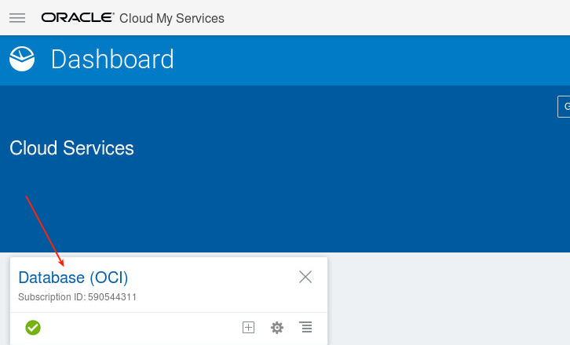
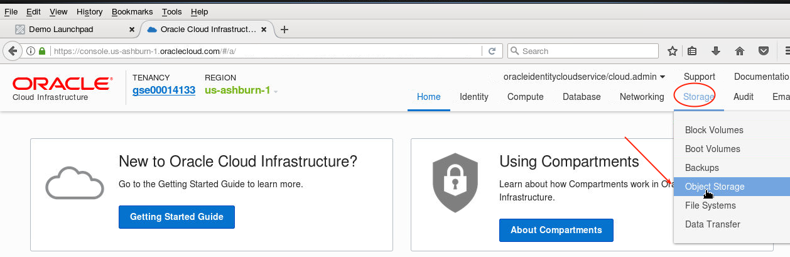
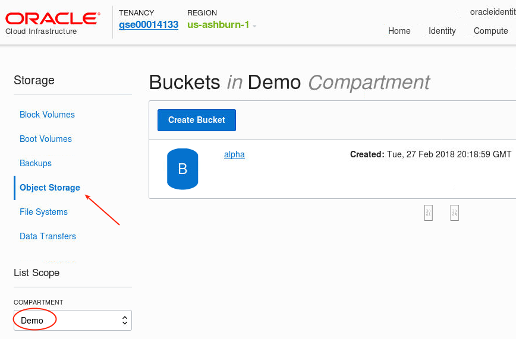
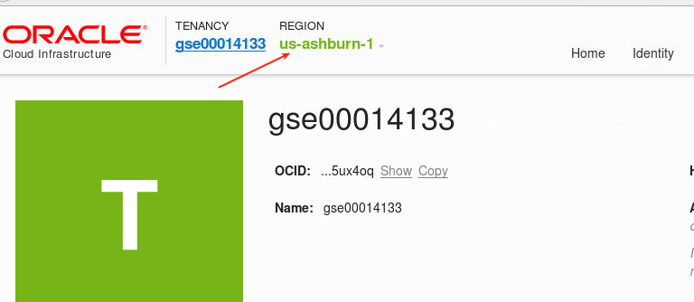
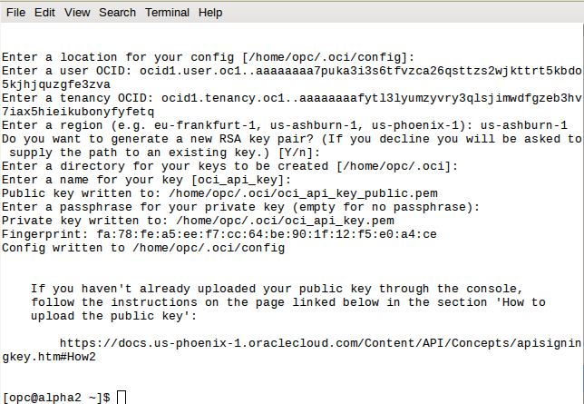

Update: March 1, 2018

## Introduction

In this Lab you will use the Oracle Command Line Interface (CLI) to retrieve information about the configuration and status of various cloud services without the need to use the Cloud Console.  Note you may wish to open a separate text window with your identity domain account and password to copy/paste these into the placeholders in the following commands, and then copy this into the terminal windows.

This lab supports the following use cases:
-	Use of Oracle's API to manage cloud databases.

Please direct comments to: Derrick Cameron (derrick.cameron@oracle.com)

## Objectives

- Install Oracle CLI
- Use oci commands to request information about DBCS related configuration and services.
- Create services with oci commands.

## Required Artifacts

-   There are no dependencies for this lab.

## Create an Object Store Bucket and Install Oracle CLI.

### **STEP 1**:  Create an Object Store Bucket

- To create an object store bucket go to the cloud console and select Database (OCI).

  

  

- Select Storage - Object Storage and select the Demo Compartment (or your working compartment).

  

  

- Select `Create Bucket`.

  

- Call the Bucket `alpha`.  Accept the defaults.

  

We will use the bucket later.

### **STEP 2**:  Collect Keys for use by the Oracle CLI in Step 3

- The following keys will be needed.  Open a notepad and save these for the configuration in step 3:
  - `tenancy` -- select tenancy and then copy OCID

  

  - `region`

  

  - `compartment` -- return to Storage - Object Storage and select the alpha bucket

  

### **STEP 3**:  Install Oracle CLI

- We need to use the opc user for the following steps.  Open a terminal window and enter the following.  
  - `ssh -i /tmp/privateKey opc@localhost` -- log into the WorkshopImage as opc
  - `sudo yum install gcc libffi-devel python-devel openssl-devel` -- enter Y to all prompts

  

  

- Now install the CLI.  Enter the following.  This will take a few minutes.
  - `bash -c "$(curl -L https://raw.githubusercontent.com/oracle/oci-cli/master/scripts/install/install.sh)"` -- accept the defaults (Y)

  

  

- Configure CLI.  Enter the following:
  - `oci setup config` -- take the defaults

  

- Respond to prompts with the OCIDs you copied in the previous step.  Accept Y to generate a new RSA key pair and accept location defaults.

  


compartment-id = ocid1.compartment.oc1..aaaaaaaar632n4aqhiwjdozs6hdloootyzsofdryppxx4o3ltgue2clwpcva
# generate a key as follows: openssl genrsa -out oci_api_key.pem 2048
key_file       = oci_api_key.pem
region         = us-ashburn-1
tenancy        = ocid1.tenancy.oc1..aaaaaaaafytl3lyumzyvry3qlsjimwdfgzeb3hv7iax5hieikubonyfyfetq
user           = ocid1.user.oc1..aaaaaaaa7puka3i3s6tfvzca26qsttzs2wjkttrt5kbdo5kjhjquzgfe3zva
bucket_name    = alpha
# get the fingerprint: https://docs.us-phoenix-1.oraclecloud.com/Content/API/Concepts/apisigningkey.htm#How3 
fingerprint    = fa:49:8b:7d:ed:d7:bb:db:58:31:e7:ad:9a:8e:d7:6e

## Curl 'Get' Examples (all commands enter in a terminal window)

### **STEP 1**: Fetch a List of Access Rules

-	Start by opening a gedit window where you can pasted and edit the commands.  Then enter the following curl command in the edit window on the compute image.  Edit this command and replace the Identity Domain and userid and password to reflect your environment.  The curl command will return a JSON formatted response providing security access rules.  Note that we are using a US data center (see the highlight below).  Many GSE instances are EMEA, in which case the URL would have an EM where the US is.  This holds for all the examples that follow.  


```
curl -i -X GET \
-u "cloud.admin:<IDENTITY DOMAIN PASSWORD>" \
-H "X-ID-TENANT-NAME: <IDENTITY DOMAIN>" \
-H "Accept: application/json" \
https://psm.us.oraclecloud.com/paas/api/v1.1/instancemgmt/<IDENTITY DOMAIN>/services/dbaas/instances/Alpha01A-DBCS/accessrules
```


### **STEP 2**: Fetch a List of All Instances

-	Enter the following in a terminal window on the compute image.  This will return a JSON formatted response providing a list of instances (not just database - all instances).
```
curl -i -X GET \
-u "cloud.admin:<IDENTITY DOMAIN PASSWORD>" \
-H "X-ID-TENANT-NAME: <IDENTITY DOMAIN>" \
-H "Accept: application/json"  \
https://psm.us.oraclecloud.com/paas/service/dbcs/api/v1.1/instances/<IDENTITY DOMAIN>
```


### **STEP 3**: Fetch a List of All Image Files

-	Enter the following in a terminal window on the compute image.  This will return a JSON formatted response providing a list of all image files.
```
curl -X GET \
-u "cloud.admin:<IDENTITY DOMAIN PASSWORD>" \
-H "X-ID-TENANT-NAME: <IDENTITY DOMAIN>" \
https://us2.storage.oraclecloud.com/v1/Storage-<IDENTITY DOMAIN>/compute_images
```


### **STEP 4**: Fetch Details of DBCS Instance Alpha01A-DBCS

-	Enter the following in a terminal window on the compute image.  This will return a JSON formatted response providing details of a particular instance (Alpha01A-DBCS in this case).
```
curl -i -X GET \
-u "cloud.admin:<IDENTITY DOMAIN PASSWORD>" \
-H "X-ID-TENANT-NAME: <IDENTITY DOMAIN>" \
-H "Accept: application/json" \
https://psm.us.oraclecloud.com/paas/api/v1.1/instancemgmt/<IDENTITY DOMAIN>/services/dbaas/instances/Alpha01A-DBCS
```


### **STEP 5**: Isolate the IP Address of Alpha01A-DBCS in the example above using 

-	Enter the following in a terminal window on the compute image.  This will return a JSON formatted response providing the IP address particular instance (Alpha01A-DBCS in this case).
```
curl -i -X GET \
-u "cloud.admin:<IDENTITY DOMAIN PASSWORD>" \
-H "X-ID-TENANT-NAME: <IDENTITY DOMAIN>" \
-H "Accept: application/json" \
https://psm.us.oraclecloud.com/paas/api/v1.1/instancemgmt/<IDENTITY DOMAIN>/services/dbaas/instances/Alpha01A-DBCS|sed -e 's/[{}]/''/g'|awk -v k="text" '{n=split($0,a,","); for (i=1; i<=n; i++) print a[i]}'|grep "ipAddress"|sed -n 1p
```


## Curl 'Put' Examples (all commands enter in a terminal window)

### **STEP 6**: Create New Access Rule - Open Port 1523

-	This creates a new access rule and enables it.
```
curl -i -X POST \
  -u "cloud.admin:<IDENTITY DOMAIN PASSWORD>" \
  -H "X-ID-TENANT-NAME: <IDENTITY DOMAIN>" \
  -d '{"ruleName":"open1523","ruleType":"USER","description":"","source":"PUBLIC-INTERNET","destination":"DB_1","ports":"1523","protocol":"tcp","status":"enabled"}' \
  -H "Accept: application/json" \
  -H "Content-Type: application/json" \
https://psm.us.oraclecloud.com/paas/api/v1.1/instancemgmt/<IDENTITY DOMAIN>/services/dbaas/instances/Alpha01A-DBCS/accessrules 
```


- Optionally - bring up the DBCS Console and confirm the rule was added.


### **STEP 7**: Create New DBCS Instance EXAMPLE

-	This creates a new DBCS Instance.  This is only an example.  We will not do this as you may be over quota, and it can take over 30 minutes to provision.
```
---------- create instance ---------- 
curl -X POST \
-u "cloud.admin:<IDENTITY DOMAIN PASSWORD>" \
-H "X-ID-TENANT-NAME: <IDENTITY DOMAIN>" \
-H "Content-Type:application/json" \
-H "Accept: application/json" \
-d @createrequestbody.json \ -- this references the file below
https://dbaas.oraclecloud.com/paas/service/dbcs/api/v1.1/instances/<IDENTITY DOMAIN>

---------- createrequestbody.json ---------- 
{
  "description": "Example service instance",
  "edition": "EE_HP",
  "level": "PAAS",
  "serviceName": "orcl2",
  "shape": "oc3",
  "subscriptionType": "HOURLY",
  "version": "12.1.0.2",
  "vmPublicKeyText": "ssh-rsa AAAAB3NzaC1yc2EAAAABJQAAAQEAjjVf7hUGWOjWa1bcPSJ1uA9Tu3rYJ/9OkmtUzPiLSv6bKs2RjxnH6l80cfZibWned7wlqZeEA1iMWza+E8nMk/0sMkO+f9HpkTCc/N4wD7nFmLiAmhivWnS2HFj4oiNPdmBM4tFhSsfEextTSRKOlIZG0m9aIAOUh7e6Tf1/XS+MTLyUYwNGkNWHtAH03J3sVf3AaJ+SxS8YyVz5SY0VnJTWRqKs5nrLfLuJEsrBZdme4RYowIqxUlYWpkaf/RjFk2kIvIN1sEQHmMe+RTZmCvaDaOmOKlLOg9pmUN7Ybra3r7BnVbr1FuAJBjFj45XisY5lmhJCNZNFl79GJ8H8hw== rsa-key-20160415",
  "parameters": [
    {
      "type": "db",
      "usableStorage": "15",
      "adminPassword": "Welcome_1",
      "sid": "orcl",
      "pdbName": "pdb1",
      "failoverDatabase": "no",
      "backupDestination": "BOTH",
      "cloudStorageContainer": "Storage-<IDENTITY DOMAIN>\/Alpha01A_DBCS_SC",
      "cloudStorageUser": "cloud.admin",
      "cloudStoragePwd": "<IDENTITY DOMAIN PASSWORD>"
    }
  ]
}
```