Update January 22, 2018

# Setup

This workshop requires several setups steps that are normally done in advance as part of an automated process prior to running the labs.  In cases where a customer wishes to run through the workshop themselves on their own without the support of Global Services Engineering (GSE) they must first walk through the following steps.  

### **STEP 1**: Log into the Cloud Console

The following creates a new DBCS Enterprise instance with backup to cloud.  Use your own SSH key or generate a new one.  

-	Log into your identitity domain/trial account.

	

-	Customize dashboard if you do not see any current services.

	

-	Select show Database.  Be sure to select **Database (OCI)** and not Database

	

-	Select Database (OCI), and then Open Service Console

	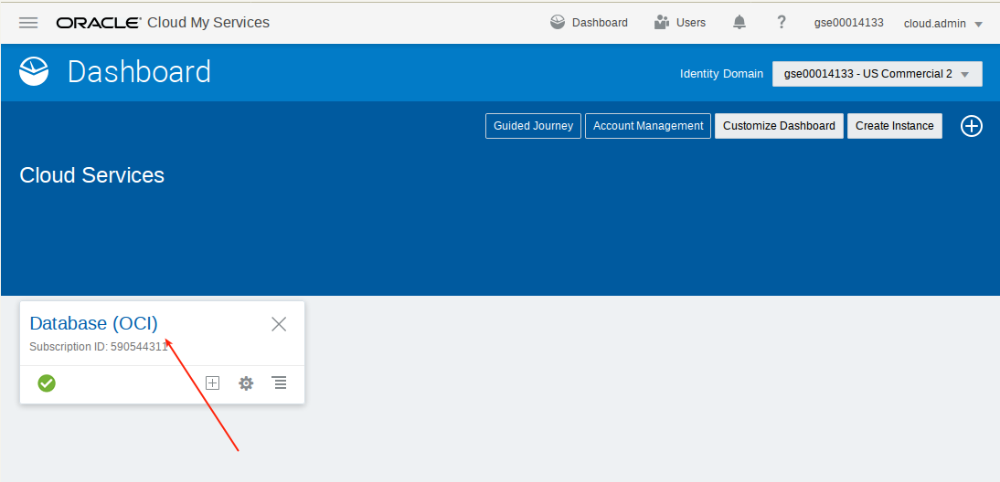

	

### **STEP 2**: Create Virtual Cloud Network

-	Select Networking, then Virtual Cloud Netowork.

	

-	Create Virtual Cloud Network.  Be sure to select the correct Compartment (ie. not root or Managed Compartment for PaaS)

	

-	Be sure to select CREATE VIRTUAL CLOUD NETWORK **PLUS RELATED RESOURCES**

	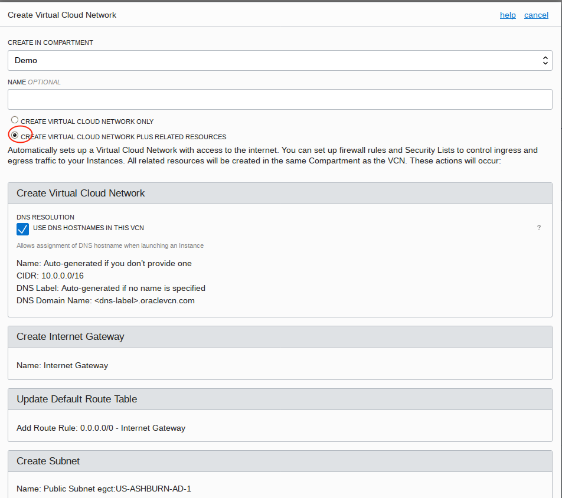

-	Take defaults thereafter.

	

	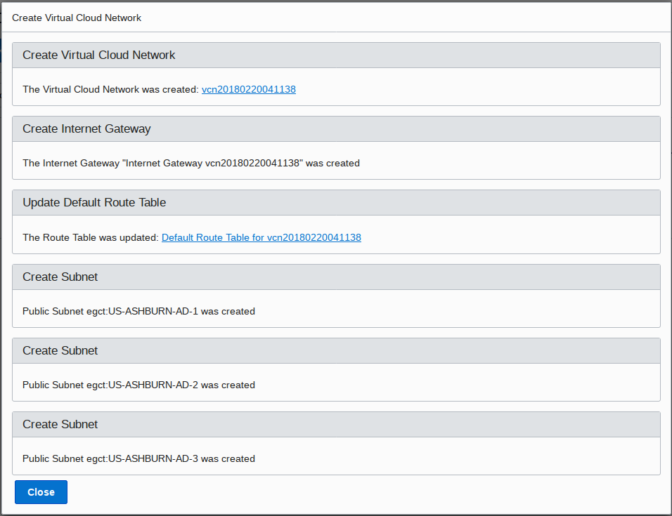

### **STEP 3**: Generate SSH Key Pair

-	When you create a DBCS instance (next step) you will be prompted for a public key.  This needs to be generated in advance.  Open Puttygen (available from the internet) and select generate a new key pair.

	

-	Then save the public key.

	

-	Name it publicKey for future reference.

	

-	Then save private key.

	

-	Save it without a passphrase.

	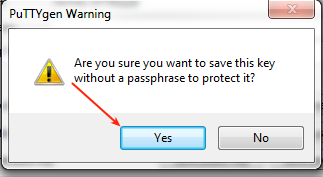

-	Name it `privateKey` for future reference.

	

### **STEP 4**: Create **Workshop** Image (DBCS Instance)

-	Select DB System from top menu.

	

-	Then Launch DB System

	

-	Enter details.  Your resources may vary by Availability Domain.  In somecases you may not have available capacity in a Domain, and if this is the case select another Domain.

	

-	Choose ssh key file.

	

-	Select `publicKey`.

	

-	Enter Database information as shown in screen shot.  Enter a password of `ALpha2018__` (note there are 2 underscores at the end).

	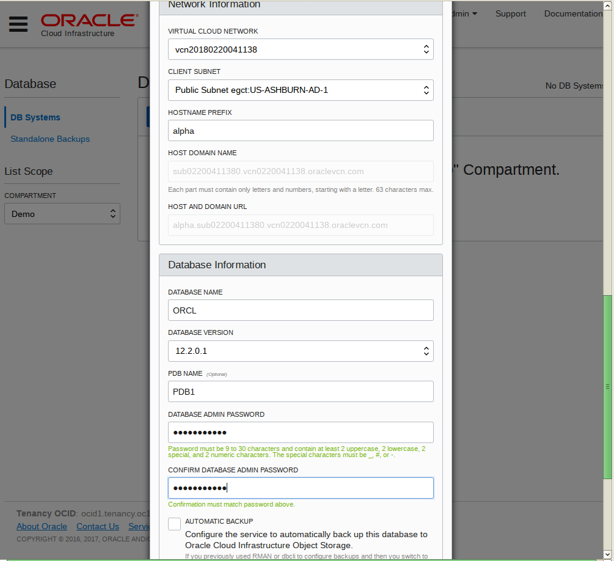

-	Then Launch DB System.

	

-	The system will begin provisioning.  This can take an hour or more.

	

### **STEP 5**: Download the Oracle Backup Module, the Adobe Yum Repository, and the public yum ol6 repository

-	Go to the following site to download opc_installer.zip and save to your local download location:  `http://www.oracle.com/technetwork/database/availability/oracle-cloud-backup-2162729.html`

	

	

-	Go to the following site and download the adobe repository: `https://get.adobe.com/flashplayer/`.  Do not select the default - select download for a different operating system (Linux 64 bit).

	

-	Select the version YUM.

	

	

-	Go to `https://public-yum.oracle.com/public-yum-ol6.repo` and save the page results to your download directory.  

	

-	Then save to your download directory.  Name the file `public-yum-ol6.repo`.

	

### **STEP 6**: Copy files to the WorkshopImage

-	Once the WorkshopImage is available log into the Cloud Console to obtain the IP address.

	

-	Open WinSCP (internet download) and log in to the IP address noted above from the Cloud Console with your private ppk key.

	

-	Ignore the warning

	

-	Select your private key.

	

	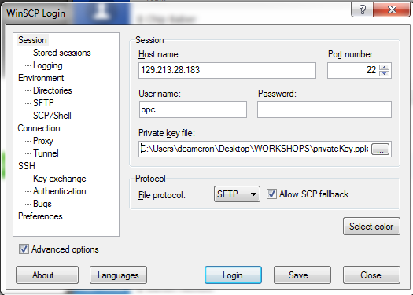

-	Select yes to cache the key

	

-	Drag the following files from your download location to the oracle folder.

	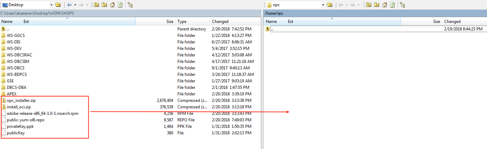

	

	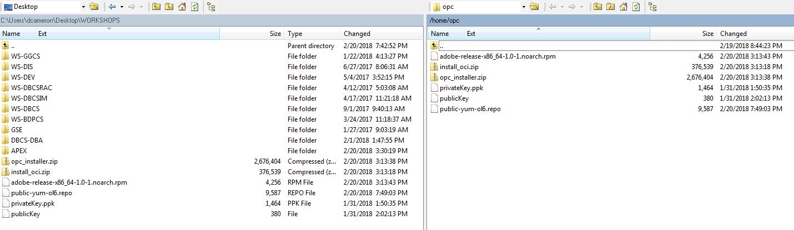

### **STEP 7**: Log into your WorkshopImage and run install scripts

-	Open Putty and log into the DBCS instance.

	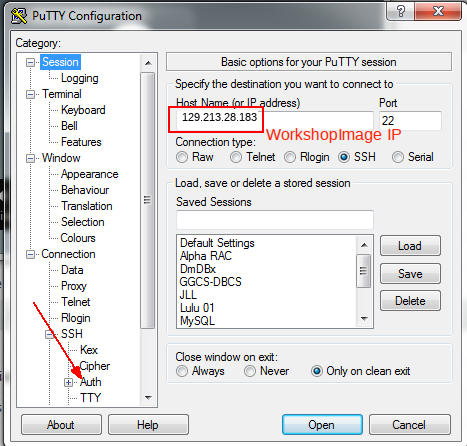

-	Select your SSH private privatekey.ppk key.

	

-	Log in as opc

	

	

-	Copy the files to the /tmp directory.  Enter the following:
	- `chmod a+rw *`
	- `cp * /tmp`

	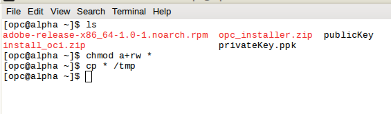

-	Install the yum repository and then adobe and git packages.  Enter the following:

```
sudo su -
cp /tmp/public-yum-ol6.repo /etc/yum.repos.d
rpm -ivh /tmp/adobe-release-x86_64-1.0-1.noarch.rpm
yum -y install git
exit
```

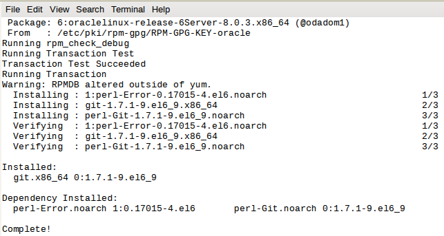

-	Log in as Oracle and clone the 
sudo su - oracle
git clone https://github.com/pcdavies/DatabaseCloudServiceForDBAsOCI.git
mv /home/oracle/DatabaseCloudServiceForDBAsOCI/workshops/dbcs-dba/install/install_oci.zip .
unzip install.zip
/home/oracle/install.sh
exit
sudo su -
/home/oracle/yum.sh
exit
```


-	Start VNC Server.  You can optionally adjust the geometry to match your screen (eg: `vncserver -geometry 1280x720`).  You will be prompted to enter a password.  Do not use the password that we have been specifying in other places in this lab document.  **VNC is open to the internet.  Select your own secure password**.  Be sure you are sudo su to oracle user.
	- `sudo su - oracle`
	- `vncserver`

	

### **STEP 5**: Open Port 5901 (VNC) and log into the desktop

-	Log back into the Cloud Console and select Database Service.

	

	

-	Select Access Rules on the right.

	

	

-	Create rule.  Note you need to refresh your screen to see the new rule after selecting create.

	

	

-	Start your VNC Viewer and log in.

	

-	This is the WorkshopImage desktop.  The background may be different across the screen shots.

	

-	We need to disable the screen saver to prevent a screen unlock prompt.  Go to the system menu on the desktop and de-activate screen saver.  If you delay in this step and the screen locks up you will need to kill the vncserver (`vncserver -kill :1`) and restart it (`vncserver`) in your terminal window.

	

	

### **STEP 6**: Set up shortcut to SQLDeveloper and import connections

-	Right click on the desktop and create a new launcher on the desktop.  Enter the Name and Command:
	- **Name:** `SqlDeveloper`
	- **Command:** `/u01/app/oracle/product/12.2.0/dbhome_1/sqldeveloper/sqldeveloper/bin/sqldeveloper`

	

	

-	Select the sqldeveloper icon from the following directory: `/u01/app/oracle/product/12.2.0/dbhome_1/sqldeveloper/`

	

	

-	Double click on the desktop icon to start sqldeveloper. Select no to import connections.

	

-	Right click on connections and select import connections.

	

-	Browse for connections file.

	

	

	

	
